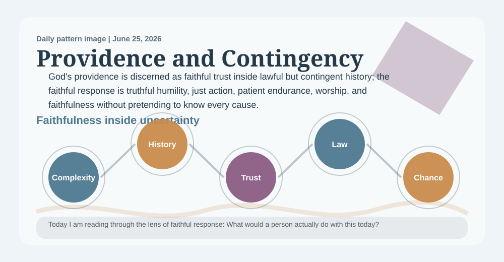
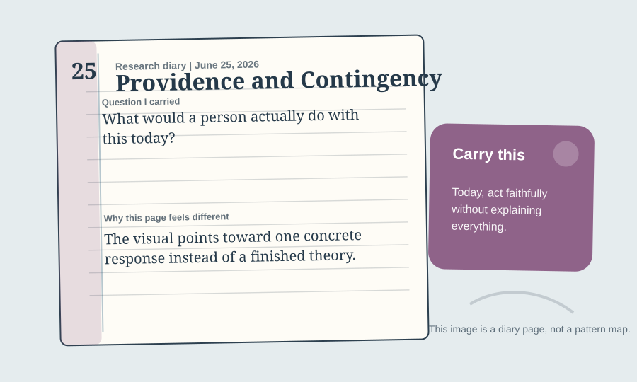

# A Deaconess Prayer Book Reading Of Providence And Contingency Pattern

_A daily book report for June 25, 2026, written as a deaconess in the Anglican Church, formed by the 1928 Book of Common Prayer._

## Today's Office

I come to this report as a deaconess in the Anglican Church might come from Morning Prayer into parish duty: with Scripture still in the ear, the Prayer Book's order still shaping the heart, and ordinary people in view. The work still has research machinery beneath it, but today I want the reading to sound less like a parts list and more like a deaconess's notebook after prayer, teaching, visitation, and works of mercy.

The daily pattern before me is **Providence And Contingency Pattern**. In plain speech, I would say it this way: Faithfulness means trusting God and acting well without pretending we know why every event happened. The movement underneath it is Stable Law -> Contingent Events -> Emergent Complexity -> Meaningful History.

The lens appointed for today is **faithful response**. That means I am not trying to say everything the project could say. I am carrying one question through the whole entry: What would a person actually do with this today?

## The Pattern In The Room

Someone loses a job, faces illness, or watches a plan collapse, and friends rush to explain what God must be doing. This pattern asks whether faith can pray, act, grieve, repent, and endure without pretending to know God's hidden reasons.

In that room, the pattern is asking me to notice this: God's providence is discerned as faithful trust inside lawful but contingent history; the faithful response is truthful humility, just action, patient endurance, worship, and faithfulness without pretending to know every cause. I would not preach that as proof. I would receive it as a possible sign of faithful order, useful only if it makes persons more truthful, humble, just, patient, and capable of love.

## The Theologian Beside The Prayer Book

The theologian section behind this entry draws on 82 analyzed theologian documents and gives special weight today to Christology, Theodicy and Suffering, Creation.

Today's theologian is **Augustine**, chosen from the rotating theologian voices gathered for this project. I would let Augustine stand beside the Prayer Book and the deaconess voice today because of rightly ordered love. Augustine would ask what this pattern does to love. If it bends love toward God and neighbor, it may be useful; if it bends love back toward pride, control, or curiosity, it needs repentance.

The wider theologian panel matters too: Augustine would ask whether trust in providence is becoming love of God rather than control over explanation. Calvin would ask whether God's care is being confessed with reverence instead of speculation. Karl Barth would ask whether providence is being read through Jesus Christ rather than through bare events. Their presence keeps the report from becoming private inspiration. The claim must pass through the Church's grammar: Christ, Scripture, worship, doctrine, repentance, mercy, and visible fruit.

Theologians should judge this pattern by whether it teaches trust, prayer, repentance, courage, and service while leaving room for grief, chance, mystery, and unfinished history.

## The 1928 Prayer Book Test

An Anglican deaconess shaped by the 1928 Book of Common Prayer would not begin by asking whether Providence And Contingency Pattern is clever. This deaconess would ask how it sounds after confession, Scripture, the creeds, the collects, Holy Communion, and the ordinary offices of prayer. The desire would be for the pattern to become reverence, repentance, charity, and steady duty. Under today's lens of faithful response, the counsel would be: carry into teaching, visitation, and works of mercy; let it make you more truthful at home, more merciful toward the weak, more faithful in worship, and less eager to explain what belongs to God. With Augustine near a deaconess's parish desk after Morning Prayer, this deaconess would also listen for rightly ordered love, asking whether the pattern has been purified by prayer, Scripture, and obedient love.

This is also where the objection belongs. A good Anglican reading should not hurry past the hard question just because the pattern is attractive. Today's objection is plain: A skeptic might say humans create providence stories to survive uncertainty, reduce anxiety, and impose meaning after the fact. The report should admit that psychology and history can explain many providence claims without proving divine action.

Meaning inside uncertainty is interesting, but the pattern should stop where grief, chance, and mystery require silence.

What would weaken this pattern is also important: It weakens if it explains tragedy too neatly, blames victims, denies chance, or borrows science language beyond its scope.

So my responsible confidence today is modest: Pastorally useful with limits: strong as a discipline of trust, weak as an explanation of hidden causes. That is not a failure of faith. It is part of reverence. The Prayer Book trains a deaconess-like reading to ask whether doctrine becomes patient instruction, mercy toward the vulnerable, reverence in worship, and practical service. It does not train a person to turn every interesting recurrence into certainty.

## Today's Rule Of Life

The daily practice is therefore small and concrete: act faithfully without explaining everything.

That is the kind of conclusion I trust most in this project: not a dazzling claim, but a disciplined act. If the pattern is near the truth, it should make the reader more faithful before it makes the reader more impressed.

## Collect

O Lord, let what is true become clear, let what is false lose its shine, and let every pattern bend toward love of Thee and love of neighbor; through Jesus Christ our Lord. Amen.

## Quiet Notes For The Reader

This entry was generated at 2026-06-25 13:52 UTC. Tomorrow the pattern, the lens, the theologian, and the Anglican reader may change. The reader role alternates every other day between deaconess and priest so the report can keep both pastoral voices in view.

Input freshness: 2026-06-24 16:21 UTC. Collector snapshot is current for this UTC day.
