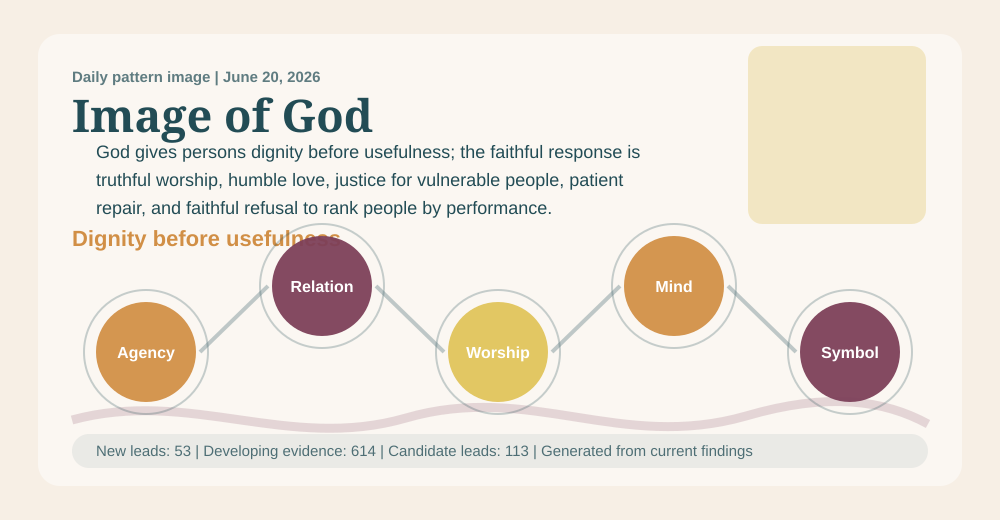

# Divine Pattern Research

## Short Book Report

_Generated: 2026-06-20 00:34 UTC_

This is the compact reading version. It tells you what the project currently sees, how strong the evidence is, what not to overclaim, and where to look next.

This report is meant to change day to day. When the collector discovers new sources and the backend re-indexes them, the pattern findings and evidence mix can change with the new material.

_Daily visual generated from the current leading finding: Image Of God Pattern._

## Short Answer

The project does not claim that patterns prove Christianity. It finds recurring patterns across theology, culture, language, suffering, science, art, music, history, and human experience, then asks whether those patterns can be responsibly read through Christian theology.

The best current posture is: the system finds and explains divine-pattern signals; you evaluate whether they seem true, faithful, useful, or weak.

## Current Pattern Found

**Current candidate divine pattern:** God gives persons dignity before usefulness; the faithful response is truthful worship, humble love, justice for vulnerable people, patient repair, and faithful refusal to rank people by performance.

**Movement:** Mind -> Symbol -> Moral Agency -> Relationship -> Worship

**Selection note:** This wording is selected from the current retrieval index because Image Of God Pattern has the strongest pattern-support score in the analyzed corpus.

## Main Divine Patterns Found

- 1. Image Of God Pattern
- 2. Trinity-As-Behavior Pattern
- 3. Cross And Reversal Pattern
- 4. Creation-To-Consciousness Pattern
- 5. Providence And Contingency Pattern
- 6. Holy Spirit Gifts Pattern
- 7. Other Religious Comparative Witness

Read the focused pattern report here:

- `reports/divine_pattern_findings.md`

## Evidence Status

- candidate lead only: 113
- developing evidence: 574

These labels are reading aids, not commands. `candidate_lead` means interesting but early. `developing_evidence` means worth considering carefully. `reviewed_evidence_ready` means it is structured enough for your evaluation.

## Biggest Current Gaps

- interpretation: 646 rule-present; 613 reviewed companion; 2 machine-drafted; 39 still missing of 687
- analogy: 648 rule-present; 595 reviewed companion; 0 machine-drafted; 39 still missing of 687
- failure_condition: 647 rule-present; 551 reviewed companion; 1 machine-drafted; 39 still missing of 687
- machine_label_boundary: 517 rule-present; 0 reviewed companion; 2 machine-drafted; 168 still missing of 687
- discernment: 656 rule-present; 341 reviewed companion; 0 machine-drafted; 31 still missing of 687

The main gap is not source volume. The main gap is clearer separation between evidence, interpretation, analogy, and failure conditions. Reviewed companions now close the named tracking gaps; they still do not raise confidence unless the original source is checked.

The system now writes a gap-fill queue here:

- `reports/review_gap_queue.md`

That queue explains why fields are missing and lists the highest-priority sources that need structured companion reviews.

## Theological Boundary

**Mission:** The Divine Pattern Project explores recurring patterns in reality and examines how those patterns align with, illuminate, challenge, or are explained by the Christian understanding of God, creation, sin, redemption, and restoration.

The project keeps this order: Scripture and revelation first, Christ and creedal guardrails next, then source quality, rival explanations, harm checks, mystery, and only then provisional confidence.

## Priestly Discernment Gate

A pattern may organize attention, but it must not guide souls unless it leads toward Christ, protects the vulnerable, honors the Church's discernment, and produces truthful love.

Before public, devotional, or pastoral use, the project now asks whether a claim would be safe beside a hospital bed, at a funeral, in confession, or with someone harmed by religious authority.

It also asks what ecclesial review is needed and how the claim remains accountable to baptism, Eucharist, confession, anointing, funerals, the church year, and daily prayer without reducing worship to symbolism.

## What This Does Not Prove

State clear limits so Divine Pattern research does not overclaim.

### Patterns do not mathematically prove God.

**Why:** Pattern recognition can support wonder, interpretation, and inquiry, but proof-language must not exceed source scope.

### Patterns do not replace Scripture or revelation.

**Why:** Christian doctrine is grounded in God's self-disclosure, not in human pattern detection.

### Patterns do not erase mystery.

**Why:** Trinity, incarnation, providence, suffering, and new creation exceed full creaturely explanation.

## Science And Quantum Guardrail

Keep scientific material useful, qualified, and protected from gaps-based theological overclaiming.

Quantum theory, mathematics, neuroscience, and AI pattern recognition may support humility and better reasoning. They should not be used as proof of God, prayer, consciousness, miracles, or providence.

## Pressure Tests That Matter Most

- Unresolved suffering
- Spiritual abuse and institutional failure
- Injustice without repair
- Rival explanations from psychology, sociology, biology, culture, politics, and literary form
- Science claims that exceed their source domain
- Other religious traditions being flattened or misread

## What You Need To Do

The report is strongest when it tells you exactly where confidence is blocked. Based on the current audit, the next work should be:

1. Move one source from `developing_evidence` to `reviewed_evidence_ready`.
   Right now the project has 574 developing-evidence records and 0 ready-for-review records. Pick one important source connected to `Image Of God Pattern` and complete every required control by hand.

2. Fill the largest explicit review gaps.
   The current biggest gaps are `ecclesial_review` (231 missing), `promotion_restraint` (231 missing), `liturgical_grounding` (230 missing), `pastoral_safety` (230 missing). These are the places where the report most needs clearer human judgment.

3. Start with the top item in the review queue.
   First queued source: `research_documents/auto_imported_cloud_candidates/application_of_the_pcr_method_to_detect_the_falsification_of_sheep_milk_with_goa_c8de0c94f99a.md`. Add source-checked companion notes for: pastoral_safety, ecclesial_review, liturgical_grounding, promotion_restraint.

4. Strengthen the leading pattern with one hard counter-reading.
   The current leading pattern is `Image Of God Pattern`. Add a serious rival explanation from psychology, sociology, history, disability studies, trauma studies, comparative religion, or philosophy, then state what would weaken the pattern.

5. Add one pastoral use case and one pastoral rejection case.
   Write a short case where the pattern helps faithful practice, and another where it would become unsafe, glib, coercive, or overconfident. This keeps the report priestly instead of merely impressive.

6. Source-check machine-drafted companions before trusting them.
   The project currently has 113 candidate leads and 453 machine-drafted companion record(s) still requiring source-check. Machine drafts can organize the work, but they should not raise confidence until the source has been directly checked.
   First machine-draft source-check item: `all_texts/comparative_text_case_notes.md`.

## Current Corpus Snapshot

- Retained cloud candidate references: 7,438
- Brand-new candidate references this run: 69
- New provider mix: Crossref: 36, OpenAlex: 18, Tavily Search: 10, Internet Archive: 4, PubMed: 1
- New candidate references in latest discovery run: 69

- Rated records: 14
- Supportive after caution/resolution: 6
- Diagnostic or unresolved friction: 2
- Currently weakening or unresolved challenge records: 6

## Detailed Reports

The detailed generated reports still exist for audit trails and deeper reading:

- `reports/divine_pattern_findings.md` (available)
- `reports/review_gap_queue.md` (available)
- `reports/ai_backend_report.txt` (available)
- `reports/divine_pattern_summary_report.txt` (available)
- `reports/top_five_divine_patterns_report.txt` (available)
- `reports/divine_pattern_test_report.txt` (available)
- `reports/deep_source_review_report.txt` (available)
- `reports/theologian_pattern_design_report.txt` (available)
- `reports/divine_pattern_reader_book.txt` (available)

Excluded generated reports:

- `reports/combined_summary_report.txt` (present and excluded): Appears to belong to the disk-cleanup/compiler workflow, so it is excluded from Divine Pattern synthesis.

## Bottom Line

The project is strongest when it gives you patterns with limits attached. The system should surface the pattern; you decide how convincing it is.

