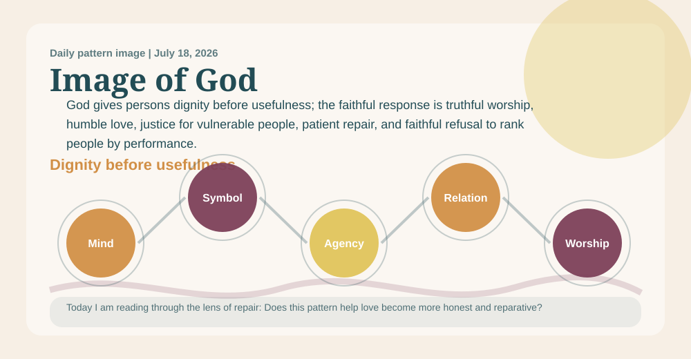
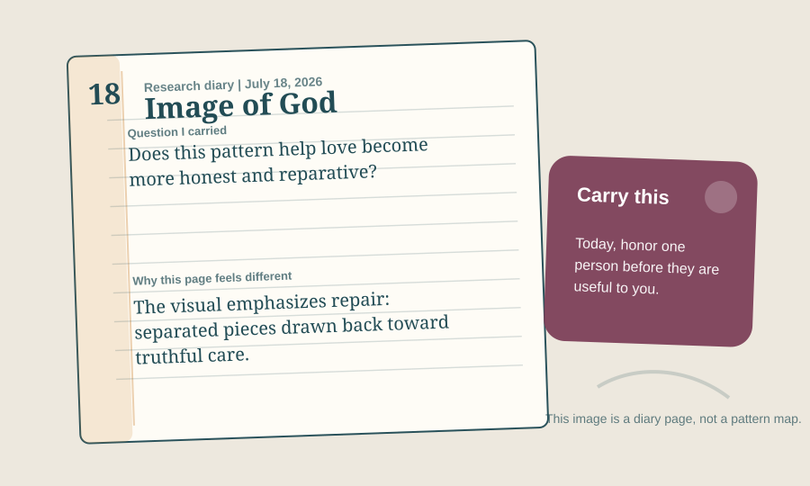

# A Priest Prayer Book Reading Of Image Of God Pattern

_A daily book report for July 18, 2026, written as an Anglican priest formed by the 1928 Book of Common Prayer._

## Today's Office

I come to this report as a priest might come to the parish desk after Morning Prayer, with chapel, study, altar, and pulpit still in view: not looking first for novelty, but for truth that can be preached without vanity, confessed without evasion, prayed without presumption, and held within the Church's doctrine. The work still has research machinery beneath it, but today I want the reading to sound less like a parts list and more like a priest's notebook after prayer.

Yesterday's deaconess would have reminded me that a claim which cannot become mercy beside a bed, in a home, or among the lonely is not yet ready for the pulpit.

The daily pattern before me is **Image Of God Pattern**. In plain speech, I would say it this way: Every person matters before they produce, perform, succeed, or impress anyone. The movement underneath it is Mind -> Symbol -> Moral Agency -> Relationship -> Worship.

The lens appointed for today is **repair**. I am not trying to say everything the project could say. I am carrying the question proper to this ministry: Can this claim be preached, confessed, prayed, and held within the Church's doctrine?

Today's focused question is: Does this pattern help love become more honest and reparative?

## The Pattern In The Room

A congregation notices that its most visible ministries praise the productive, articulate, and financially stable, while a disabled member and an elderly caregiver are treated as burdens. This pattern asks whether the church will reorganize its attention around gift, dignity, and belonging before usefulness.

I am listening for whether this pattern can stand in the nave and the study as well as in private thought: named plainly, tested publicly, and restrained by worship.

In that room, the pattern is asking me to notice this: God gives persons dignity before usefulness; the faithful response is truthful worship, humble love, justice for vulnerable people, patient repair, and faithful refusal to rank people by performance. I would not preach that as proof or carry it as a slogan. I would receive it as a possible sign of faithful order only if it can serve this ministry: doctrine, Scripture, creed, sacrament, worship, preaching, theological discernment, and public teaching.

## Today’s Discovery

The freshest thing in the available discovery record is not yet a claim for the pulpit, but a new cluster for the study: 40 candidate references, led by OpenAlex (19) and routed most strongly toward human_stories (14). This must be read cautiously, since the collector snapshot is current for this UTC day.

That cluster gives the priest work to test, not a sermon to announce. 31 new items is routed to the review queue. Optional `public_final_ready` metadata appears on 0 sources; 1 source currently carries reviewed-evidence-ready metadata.

No findings currently meet the optional polished-publication metadata state. Research findings remain visible below with their current strength and limitations; `public_final_ready` does not determine research visibility or theological authority.

## What Changed Since Yesterday

Yesterday's snapshot says the report stood under a deaconess reader, the **mystery** lens, and **Karl Barth**. Today it stands under a priest reader, the **repair** lens, and **Dietrich Bonhoeffer**.

The named pattern changed from **Creation-To-Consciousness Pattern** to **Image Of God Pattern**. candidate references rose from 21 to 40; review queue items held at 1,030; public-final claims held at 0. The strongest routed lane changed from **theologians** to **human_stories**.

The priestly reading should receive those changes at chapel, study, altar, and pulpit: useful for discernment, but not automatically ready for public teaching.

## The Theologian Beside The Prayer Book

The theologian section behind this entry draws on 202 analyzed theologian documents and gives special weight today to Christology, Theodicy and Suffering, Trinity.

Today's theologian is **Dietrich Bonhoeffer**, chosen from the rotating theologian voices gathered for this project. I would let Dietrich Bonhoeffer stand beside the Prayer Book and the priest voice today because of costly discipleship and concrete obedience. Bonhoeffer would ask what this pattern costs in actual obedience. If it does not become truth, service, courage, and neighbor-love, it remains too abstract.

The theological question is warm but exacting: can this claim pass through Christ, Scripture, the Creeds, worship, repentance, charity, and visible fruit?

The wider theologian panel matters too: Irenaeus would ask whether human life is being received as created for communion with God, not reduced to capacity or status. Aquinas would ask whether dignity is grounded in God as creator and end, not in usefulness to the community. Bonhoeffer would ask whether the church protects concrete neighbors, not only an abstract idea of humanity. Their presence keeps the report from becoming private inspiration. It must pass through Christ, Scripture, the Creeds, worship, repentance, charity, sacrament, and visible fruit.

Theologians should judge this pattern by whether it protects the image of God in weak, wounded, disabled, poor, unborn, elderly, imprisoned, displaced, and overlooked people.

## The 1928 Prayer Book Test

An Anglican priest shaped by the 1928 Book of Common Prayer would not begin by asking whether Image Of God Pattern is clever. This priest would ask how it sounds within chapel, study, altar, pulpit, parish desk, and the gathered worship of the Church. The ministry in view is doctrine, Scripture, creed, sacrament, worship, preaching, theological discernment, and public teaching. It must pass through Christ, Scripture, the Creeds, worship, repentance, charity, sacrament, and visible fruit. The desire would be for the pattern to become reverence, repentance, charity, and steady duty. Under today's lens of repair, the counsel would be: test before Scripture, creed, altar, pulpit, and pastoral charity; let it make you more truthful at home, more merciful toward the weak, more faithful in worship, and less eager to explain what belongs to God. With Dietrich Bonhoeffer near a priest's parish desk after Morning Prayer, near chapel, altar, and pulpit, this priest would also listen for costly discipleship and concrete obedience, asking whether the pattern has been purified by prayer, Scripture, and obedient love.

A priest must refuse any attractive pattern that cannot be preached honestly, prayed humbly, confessed within the Church's doctrine, or offered near the altar without overclaim.

The Prayer Book test must also say no. It says no to haste, no to decorative certainty, no to using holy language where repentance, repair, silence, or better evidence is required.

Today's objection is plain: A skeptic might say dignity language is a social achievement built through rights movements, empathy, law, and shared vulnerability, not evidence of a divine pattern. The report should admit that this rival explanation can account for much of the visible pattern.

The specific failure condition is this: It weakens if dignity becomes a slogan while real vulnerable people remain ignored or ranked by usefulness.

The confidence therefore remains modest: Pastorally useful with limits: strong enough to guide daily practice, but still provisional as a pattern claim.

## Today's Rule Of Life

The rule for today is brief enough to obey: honor one person before they are useful to you.

Practice it in one restraint: do not teach or preach the claim beyond what Scripture, creed, worship, and charity can bear.

Let the report end in duty before it seeks admiration. A faithful pattern should leave a person readier for truth, mercy, justice, patience, and worship.

## Collect

O Lord, purify our doctrine, govern our preaching, deepen our worship, and make every true word fruitful in repentance and charity; through Jesus Christ our Lord. Amen.

## Complete Research State

Every coherent, traceable candidate is shown here regardless of `public_final_ready`. Research strength controls the label and wording; public visibility does not imply theological approval.

### Supported with Qualifications: Image Of God Pattern

- **Plain-language description:** Every person matters before they produce, perform, succeed, or impress anyone.
- **Research question:** Does this pattern make ordinary people more likely to honor human dignity in daily life?
- **Research-strength status:** Supported with Qualifications
- **Status rationale:** 11 traceable indexed document(s) currently contribute to this candidate. The strongest existing research tier is `reviewed_evidence_ready`.
- **Supporting evidence:**
  - Application of the PCR method to detect the falsification of sheep milk with goat milk (developing_evidence)
  - Divine Pattern Candidates (candidate_lead)
  - Friction Layer (candidate_lead)
  - Next Research Expansion Tracker (developing_evidence)
  - Reviewed Source Packs (developing_evidence)
- **Counterevidence:**
  - None recorded; absence is not proof that none exists.
- **Rival explanations:**
  - Incomplete or unavailable.
- **Known limitations:**
  - counter_reading
  - doctrinal_fit
  - does_not_prove_boundary
  - ecclesial_review
  - evidence
  - final_promotion_restraint
- **Failure conditions:**
  - It weakens if dignity becomes a slogan while real vulnerable people remain ignored or ranked by usefulness.
- **Unresolved tensions:**
  - counter_reading
  - doctrinal_fit
  - does_not_prove_boundary
- **Provenance:**
  - research_documents/auto_imported_cloud_candidates/application_of_the_pcr_method_to_detect_the_falsification_of_sheep_milk_with_goa_c8de0c94f99a.md
  - research_documents/christian_sources/divine_pattern_candidates.md
  - research_documents/friction_layer.md
  - research_documents/next_research_expansion_tracker.md
  - research_documents/reviewed_source_packs.md
  - research_documents/source_packs/image_of_god_pattern_pack.md
  - history_inputs/reviewed_growth_batch_2026_05_27.md
  - pattern_tests/leading_patterns_pressure_2026_06_04.md
  - pattern_tests/leading_patterns_pressure_2026_06_04_second_pass.md
  - pattern_tests/leading_patterns_pressure_2026_06_04_third_pass.md
  - pattern_tests/top_five_pattern_competition_matrix.md
- **Provenance status:** `traceable_index_paths`
- **Divine Core theological interpretation:** `interpretation_not_evaluated`
- **What this finding does not prove:**
  - A non-proof boundary has not yet been recorded.
- **Presentation metadata:**
  - `public_final_ready`: `false` (additional polished-publication checks incomplete)
  - This metadata does not determine visibility, research strength, truth, or theological approval.

### Supported with Qualifications: Cross And Reversal Pattern

- **Plain-language description:** God's way of saving does not flatter power; it tells the truth, protects the harmed, and lets hope come through mercy and resurrection.
- **Research question:** Does this pattern help people tell the truth about harm while moving toward mercy, justice, and hope?
- **Research-strength status:** Supported with Qualifications
- **Status rationale:** 8 traceable indexed document(s) currently contribute to this candidate. The strongest existing research tier is `developing_evidence`.
- **Supporting evidence:**
  - Divine Pattern Candidates (candidate_lead)
  - Next Research Expansion Tracker (developing_evidence)
  - Reviewed Source Packs (developing_evidence)
  - Source Pack: Cross And Reversal Pattern (developing_evidence)
  - Leading Patterns Pressure Test, 2026-06-04 (candidate_lead)
- **Counterevidence:**
  - None recorded; absence is not proof that none exists.
- **Rival explanations:**
  - Incomplete or unavailable.
- **Known limitations:**
  - counter_reading
  - ecclesial_review
  - evidence
  - liturgical_grounding
  - machine_label_boundary
  - pastoral_safety
- **Failure conditions:**
  - It weakens if cross-language protects abusers, silences lament, or treats suffering itself as holy.
- **Unresolved tensions:**
  - counter_reading
  - ecclesial_review
  - evidence
- **Provenance:**
  - research_documents/christian_sources/divine_pattern_candidates.md
  - research_documents/next_research_expansion_tracker.md
  - research_documents/reviewed_source_packs.md
  - research_documents/source_packs/cross_and_reversal_pattern_pack.md
  - pattern_tests/leading_patterns_pressure_2026_06_04.md
  - pattern_tests/leading_patterns_pressure_2026_06_04_second_pass.md
  - pattern_tests/leading_patterns_pressure_2026_06_04_third_pass.md
  - pattern_tests/top_five_pattern_competition_matrix.md
- **Provenance status:** `traceable_index_paths`
- **Divine Core theological interpretation:** `interpretation_not_evaluated`
- **What this finding does not prove:**
  - A non-proof boundary has not yet been recorded.
- **Presentation metadata:**
  - `public_final_ready`: `false` (additional polished-publication checks incomplete)
  - This metadata does not determine visibility, research strength, truth, or theological approval.

### Supported with Qualifications: Creation-To-Consciousness Pattern

- **Plain-language description:** Creation invites wonder, but wonder should turn into humility, care for bodies, and responsibility for the world.
- **Research question:** Does this pattern create wonder and responsibility without pretending science mechanically proves worship?
- **Research-strength status:** Supported with Qualifications
- **Status rationale:** 8 traceable indexed document(s) currently contribute to this candidate. The strongest existing research tier is `developing_evidence`.
- **Supporting evidence:**
  - Divine Pattern Candidates (candidate_lead)
  - Next Research Expansion Tracker (developing_evidence)
  - Reviewed Source Packs (developing_evidence)
  - Source Pack: Creation-To-Consciousness Pattern (developing_evidence)
  - Leading Patterns Pressure Test, 2026-06-04 (candidate_lead)
- **Counterevidence:**
  - None recorded; absence is not proof that none exists.
- **Rival explanations:**
  - Incomplete or unavailable.
- **Known limitations:**
  - counter_reading
  - ecclesial_review
  - evidence
  - liturgical_grounding
  - machine_label_boundary
  - pastoral_safety
- **Failure conditions:**
  - It weakens if it ignores evolution, animal suffering, ecological loss, disability, or natural explanations.
- **Unresolved tensions:**
  - counter_reading
  - ecclesial_review
  - evidence
- **Provenance:**
  - research_documents/christian_sources/divine_pattern_candidates.md
  - research_documents/next_research_expansion_tracker.md
  - research_documents/reviewed_source_packs.md
  - research_documents/source_packs/creation_to_consciousness_pattern_pack.md
  - pattern_tests/leading_patterns_pressure_2026_06_04.md
  - pattern_tests/leading_patterns_pressure_2026_06_04_second_pass.md
  - pattern_tests/leading_patterns_pressure_2026_06_04_third_pass.md
  - pattern_tests/top_five_pattern_competition_matrix.md
- **Provenance status:** `traceable_index_paths`
- **Divine Core theological interpretation:** `interpretation_not_evaluated`
- **What this finding does not prove:**
  - A non-proof boundary has not yet been recorded.
- **Presentation metadata:**
  - `public_final_ready`: `false` (additional polished-publication checks incomplete)
  - This metadata does not determine visibility, research strength, truth, or theological approval.

### Supported with Qualifications: Trinity-As-Behavior Pattern

- **Plain-language description:** True doctrine should become visible as love, humility, holiness, unity, service, and patient faithfulness.
- **Research question:** Does this pattern keep the Trinity Christian, concrete, and fruitful rather than vague or controlling?
- **Research-strength status:** Supported with Qualifications
- **Status rationale:** 9 traceable indexed document(s) currently contribute to this candidate. The strongest existing research tier is `developing_evidence`.
- **Supporting evidence:**
  - Divine Pattern Candidates (candidate_lead)
  - Daily Cloud Reference Review Log (candidate_lead)
  - Next Research Expansion Tracker (developing_evidence)
  - Reviewed Source Packs (developing_evidence)
  - Source Pack: Trinity-As-Behavior Pattern (developing_evidence)
- **Counterevidence:**
  - None recorded; absence is not proof that none exists.
- **Rival explanations:**
  - Incomplete or unavailable.
- **Known limitations:**
  - counter_reading
  - ecclesial_review
  - evidence
  - liturgical_grounding
  - machine_label_boundary
  - pastoral_safety
- **Failure conditions:**
  - It weakens if the Trinity becomes a metaphor for group energy, authoritarian control, modalism, or three separate gods.
- **Unresolved tensions:**
  - counter_reading
  - ecclesial_review
  - evidence
- **Provenance:**
  - research_documents/christian_sources/divine_pattern_candidates.md
  - research_documents/daily_cloud_reference_review_log.md
  - research_documents/next_research_expansion_tracker.md
  - research_documents/reviewed_source_packs.md
  - research_documents/source_packs/trinity_as_behavior_pattern_pack.md
  - pattern_tests/leading_patterns_pressure_2026_06_04.md
  - pattern_tests/leading_patterns_pressure_2026_06_04_second_pass.md
  - pattern_tests/leading_patterns_pressure_2026_06_04_third_pass.md
  - pattern_tests/top_five_pattern_competition_matrix.md
- **Provenance status:** `traceable_index_paths`
- **Divine Core theological interpretation:** `interpretation_not_evaluated`
- **What this finding does not prove:**
  - A non-proof boundary has not yet been recorded.
- **Presentation metadata:**
  - `public_final_ready`: `false` (additional polished-publication checks incomplete)
  - This metadata does not determine visibility, research strength, truth, or theological approval.

### Supported with Qualifications: Providence And Contingency Pattern

- **Plain-language description:** Faithfulness means trusting God and acting well without pretending we know why every event happened.
- **Research question:** Does this pattern help ordinary people act faithfully inside uncertainty?
- **Research-strength status:** Supported with Qualifications
- **Status rationale:** 8 traceable indexed document(s) currently contribute to this candidate. The strongest existing research tier is `developing_evidence`.
- **Supporting evidence:**
  - Divine Pattern Candidates (candidate_lead)
  - Next Research Expansion Tracker (developing_evidence)
  - Reviewed Source Packs (developing_evidence)
  - Source Pack: Providence And Contingency Pattern (developing_evidence)
  - Leading Patterns Pressure Test, 2026-06-04 (candidate_lead)
- **Counterevidence:**
  - None recorded; absence is not proof that none exists.
- **Rival explanations:**
  - Incomplete or unavailable.
- **Known limitations:**
  - counter_reading
  - ecclesial_review
  - evidence
  - liturgical_grounding
  - machine_label_boundary
  - pastoral_safety
- **Failure conditions:**
  - It weakens if it explains tragedy too neatly, blames victims, denies chance, or borrows science language beyond its scope.
- **Unresolved tensions:**
  - counter_reading
  - ecclesial_review
  - evidence
- **Provenance:**
  - research_documents/christian_sources/divine_pattern_candidates.md
  - research_documents/next_research_expansion_tracker.md
  - research_documents/reviewed_source_packs.md
  - research_documents/source_packs/providence_and_contingency_pattern_pack.md
  - pattern_tests/leading_patterns_pressure_2026_06_04.md
  - pattern_tests/leading_patterns_pressure_2026_06_04_second_pass.md
  - pattern_tests/leading_patterns_pressure_2026_06_04_third_pass.md
  - pattern_tests/top_five_pattern_competition_matrix.md
- **Provenance status:** `traceable_index_paths`
- **Divine Core theological interpretation:** `interpretation_not_evaluated`
- **What this finding does not prove:**
  - A non-proof boundary has not yet been recorded.
- **Presentation metadata:**
  - `public_final_ready`: `false` (additional polished-publication checks incomplete)
  - This metadata does not determine visibility, research strength, truth, or theological approval.

## Quiet Notes For The Reader

This entry was generated at 2026-07-18 14:51 UTC. Tomorrow the pattern, the lens, the theologian, and the Anglican reader may change. The reader role alternates every other day between deaconess and priest so the report can keep both pastoral voices in view.

Input freshness: 2026-07-18 14:50 UTC. Collector snapshot is current for this UTC day.
