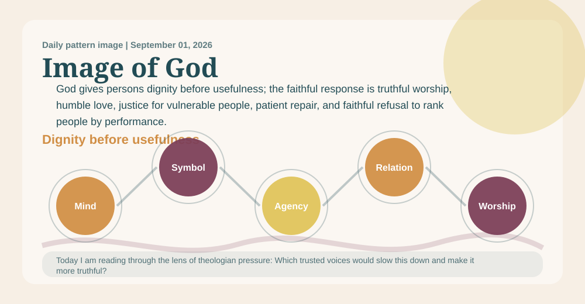
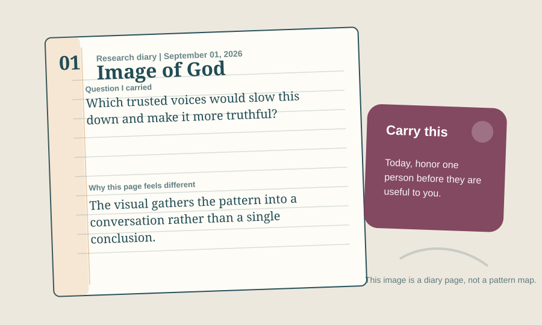

# A Deaconess Prayer Book Reading Of Image Of God Pattern

_A daily book report for September 01, 2026, written as an Anglican deaconess formed by the 1928 Book of Common Prayer and shaped by practical theology._

## Today's Office

I come to this report as a deaconess in the Anglican Church might return from Morning Prayer and the parish road: with Scripture still in the ear, the Prayer Book's order still shaping the heart, and particular souls still before me from homes, bedsides, schools, and works of mercy. This is practical theology under Anglican obedience, not a softer theology and not therapeutic technique: doctrine, worship, Scripture, prayer, ethics, and spiritual formation pressed toward faithful action. The work still has research machinery beneath it, but today I want the reading to sound less like a parts list and more like a deaconess's notebook after prayer, visitation, encouragement, and care for the poor and lonely.

The priestly caution of yesterday guards today's mercy from becoming sentiment: what I carry to homes and bedsides must still be true before Scripture, creed, and worship.

An Anglican deaconess formed by the 1928 Book of Common Prayer, shaped by practical theology, pastoral care, spiritual formation, Christian ethics, and the historic ministry of mercy within the Church.

The daily pattern before me is **Image Of God Pattern**. In plain speech, I would say it this way: Every person matters before they produce, perform, succeed, or impress anyone. The movement underneath it is Mind -> Symbol -> Moral Agency -> Relationship -> Worship.

The lens appointed for today is **theologian pressure**. I am not trying to say everything the project could say. I am carrying the question proper to this ministry: How does this truth become faithful action?

Today's focused question is: Which trusted voices would slow this down and make it more truthful?

## The Pattern In The Room

A congregation notices that its most visible ministries praise the productive, articulate, and financially stable, while a disabled member and an elderly caregiver are treated as burdens. This pattern asks whether the church will reorganize its attention around gift, dignity, and belonging before usefulness.

I am listening for what this pattern does in a room where someone is suffering, grieving, lonely, serving, learning, or in need of courage for ordinary obedience.

In that room, the pattern is asking me to notice this: God gives persons dignity before usefulness; the faithful response is truthful worship, humble love, justice for vulnerable people, patient repair, and faithful refusal to rank people by performance. I would not preach that as proof or carry it as a slogan. I would receive it as a possible sign of faithful order only if it can serve this ministry: practical theology, pastoral theology, spiritual formation, Christian ethics, diaconal ministry, soul care, works of mercy, ordinary holiness, embodied obedience, service, and ordinary discipleship.

## Today’s Discovery

The freshest thing in the available discovery record is not a new certainty for the parish road, but a new cluster needing care: 25 candidate references, led by OpenAlex (13), with the strongest routed lane showing as cultural_inputs (10). This must be read cautiously, since the collector snapshot is current for this UTC day.

That is a mercy-shaped warning rather than a comfort to distribute. 16 new items may be ready for the review queue, image (3) appears in the media mix, and optional `public_final_ready` metadata appears on 0 sources.

No findings currently meet the optional polished-publication metadata state. Research findings remain visible below with their current strength and limitations; `public_final_ready` does not determine research visibility or theological authority.

## What Changed Since Yesterday

Yesterday's snapshot says the report stood under a priest reader, the **pastoral safety** lens, and **Karl Barth**. Today it stands under a deaconess reader, the **theologian pressure** lens, and **Dietrich Bonhoeffer**.

The named pattern changed from **Creation-To-Consciousness Pattern** to **Image Of God Pattern**. candidate references rose from 18 to 25; review queue items held at 1,030; public-final claims held at 0. The strongest routed lane changed from **deep_sources** to **cultural_inputs**.

The deaconess reading should carry those changes onto the parish road carefully: useful for attention, but not automatically ready for homes, bedsides, or wounded hearts.

## The Theologian Beside The Prayer Book

The theologian section behind this entry draws on 406 analyzed theologian documents and gives special weight today to Trinity, Pneumatology, Christology.

Today's theologian is **Dietrich Bonhoeffer**, chosen from the rotating theologian voices gathered for this project. I would let Dietrich Bonhoeffer stand beside the Prayer Book and the deaconess voice today because of costly discipleship and concrete obedience. Bonhoeffer would ask what this pattern costs in actual obedience. If it does not become truth, service, courage, and neighbor-love, it remains too abstract.

The theological question is therefore not smaller, but nearer to the ground: can this claim be prayed, read with Scripture, formed by worship, tested by Church teaching, obeyed in mercy, and carried without harming vulnerable souls?

The wider theologian panel matters too: Irenaeus would ask whether human life is being received as created for communion with God, not reduced to capacity or status. Aquinas would ask whether dignity is grounded in God as creator and end, not in usefulness to the community. Bonhoeffer would ask whether the church protects concrete neighbors, not only an abstract idea of humanity. Their presence keeps the report from becoming private inspiration. It must pass through Scripture, prayer, worship, Church teaching, the 1928 Prayer Book, mercy, embodied obedience, daily duty, and care for the vulnerable.

Theologians should judge this pattern by whether it protects the image of God in weak, wounded, disabled, poor, unborn, elderly, imprisoned, displaced, and overlooked people.

## The 1928 Prayer Book Test

An Anglican deaconess shaped by the 1928 Book of Common Prayer would not begin by asking whether Image Of God Pattern is clever. This deaconess would ask how it sounds within homes, bedsides, parish roads, schools, and the rooms of the poor and lonely. An Anglican deaconess formed by the 1928 Book of Common Prayer, shaped by practical theology, pastoral care, spiritual formation, Christian ethics, and the historic ministry of mercy within the Church. The ministry in view is practical theology, pastoral theology, spiritual formation, Christian ethics, diaconal ministry, soul care, works of mercy, ordinary holiness, embodied obedience, service, and ordinary discipleship. It must pass through Scripture, prayer, worship, Church teaching, the 1928 Prayer Book, mercy, embodied obedience, daily duty, and care for the vulnerable. The desire would be for the pattern to become reverence, repentance, charity, and steady duty. Under today's lens of theologian pressure, the counsel would be: carry into visitation, teaching, encouragement, and works of mercy; let it make you more truthful at home, more merciful toward the weak, more faithful in worship, and less eager to explain what belongs to God. With Dietrich Bonhoeffer near a deaconess's parish table after Morning Prayer and visitation, this deaconess would also listen for costly discipleship and concrete obedience, asking whether the pattern has been purified by prayer, Scripture, and obedient love.

A deaconess must refuse any beautiful pattern that makes suffering decorative, service sentimental, speech therapeutic instead of truthful, or vulnerable people carry the burden of someone else's certainty.

The Prayer Book test must also say no. It says no to haste, no to decorative certainty, no to using holy language where repentance, repair, silence, or better evidence is required.

Today's objection is plain: A skeptic might say dignity language is a social achievement built through rights movements, empathy, law, and shared vulnerability, not evidence of a divine pattern. The report should admit that this rival explanation can account for much of the visible pattern.

The specific failure condition is this: It weakens if dignity becomes a slogan while real vulnerable people remain ignored or ranked by usefulness.

The confidence therefore remains modest: Pastorally useful with limits: strong enough to guide daily practice, but still provisional as a pattern claim.

## Today's Rule Of Life

The rule for today is brief enough to obey: honor one person before they are useful to you.

Practice it in one restraint: do not carry an unready certainty into a conversation where a soul needs truth spoken gently, prayerfully, and with concrete mercy.

Let the report end in duty before it seeks admiration. A faithful pattern should leave a person readier for truth, mercy, justice, patience, and worship.

## Collect

O Lord, order our mercy, cleanse our speech, strengthen our hands for service, and make every true sign fruitful in care for the least and lonely; through Jesus Christ our Lord. Amen.

## Research Behind This Reflection

The Image Of God Pattern remains under evaluation. The current research supports it with qualifications: 11 traceable documents contribute to the inquiry, and the pattern is meaningful enough to keep testing.

Its central limitation is practical and severe: It weakens if dignity becomes a slogan while real vulnerable people remain ignored or ranked by usefulness. If the pattern does not change attention, protection, belonging, and service, its language has outrun its evidence and its obedience.

This evidence does not prove divine action, establish doctrine by research, or settle a theological judgment. Social movements, law, empathy, shared vulnerability, psychology, culture, and political history may explain much of the visible pattern. Research serves discernment; it does not replace Scripture, doctrine, worship, or the Church's judgment.

[Read the complete technical research record, including evidence, limitations, provenance, and Divine Core interpretation status](final_book_report_research_appendix.md).

## Recent Reading Behind This Pattern

These recent discoveries illuminate the question from several directions. They contribute evidence, qualifications, and objections, but none independently proves the theological pattern or constitutes Divine Core approval.

No recently discovered source is both sufficiently traceable and directly relevant to this pattern. The report does not add weak matches merely to fill the list.

## Quiet Notes For The Reader

This entry was generated at 2026-09-01 17:41 UTC. Tomorrow the pattern, the lens, the theologian, and the Anglican reader may change. The reader role alternates every other day between deaconess and priest so the report can keep both pastoral voices in view.

Input freshness: 2026-09-01 17:39 UTC. Collector snapshot is current for this UTC day.
