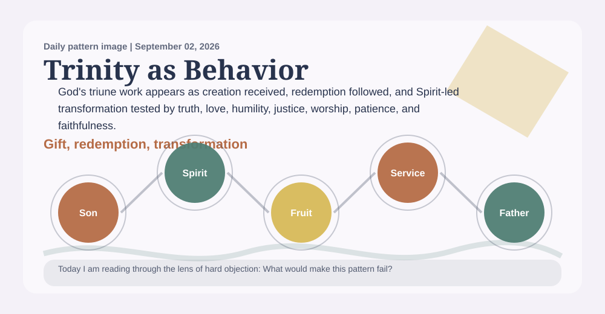
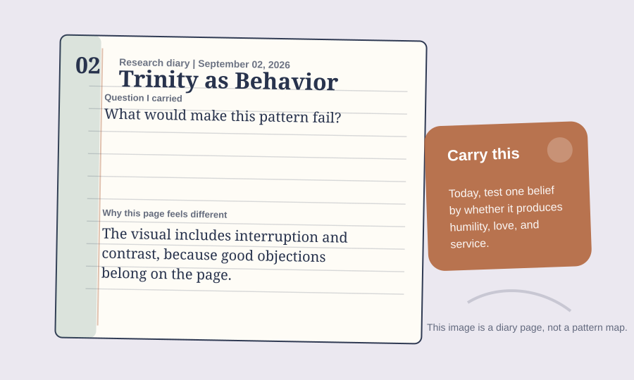

# A Priest Prayer Book Reading Of Trinity-As-Behavior Pattern

_A daily book report for September 02, 2026, written as an Anglican priest formed by the 1928 Book of Common Prayer._

## Today's Office

I come to this report as a priest might come to the parish desk after Morning Prayer, with chapel, study, altar, and pulpit still in view: not looking first for novelty, but for truth that can be preached without vanity, confessed without evasion, prayed without presumption, and held within the Church's doctrine. The work still has research machinery beneath it, but today I want the reading to sound less like a parts list and more like a priest's notebook after prayer.

Yesterday's deaconess would have reminded me that a claim which cannot become mercy beside a bed, in a home, or among the lonely is not yet ready for the pulpit.

The daily pattern before me is **Trinity-As-Behavior Pattern**. In plain speech, I would say it this way: True doctrine should become visible as love, humility, holiness, unity, service, and patient faithfulness. The movement underneath it is Father Creates -> Son Redeems -> Spirit Transforms.

The lens appointed for today is **hard objection**. I am not trying to say everything the project could say. I am carrying the question proper to this ministry: Can this claim be preached, confessed, prayed, and held within the Church's doctrine?

Today's focused question is: What would make this pattern fail?

## The Pattern In The Room

A church says it believes orthodox doctrine, but its common life is anxious, competitive, controlling, and unkind. This pattern asks whether Trinitarian language is becoming worshipful love, humble service, and Spirit-tested fruit, or staying as correct words without visible formation.

I am listening for whether this pattern can stand in the nave and the study as well as in private thought: named plainly, tested publicly, and restrained by worship.

In that room, the pattern is asking me to notice this: God's triune work appears as creation received, redemption followed, and Spirit-led transformation tested by truth, love, humility, justice, worship, patience, and faithfulness. I would not preach that as proof or carry it as a slogan. I would receive it as a possible sign of faithful order only if it can serve this ministry: doctrine, Scripture, creed, sacrament, worship, preaching, theological discernment, and public teaching.

## Today’s Discovery

The freshest thing in the available discovery record is not yet a claim for the pulpit, but a new cluster for the study: 20 candidate references, led by OpenAlex (13) and routed most strongly toward deep_sources (8). This must be read cautiously, since the collector snapshot is current for this UTC day.

That cluster gives the priest work to test, not a sermon to announce. 16 new items is routed to the review queue. Optional `public_final_ready` metadata appears on 0 sources; 1 source currently carries reviewed-evidence-ready metadata.

No findings currently meet the optional polished-publication metadata state. Research findings remain visible below with their current strength and limitations; `public_final_ready` does not determine research visibility or theological authority.

## What Changed Since Yesterday

Yesterday's snapshot says the report stood under a deaconess reader, the **theologian pressure** lens, and **Dietrich Bonhoeffer**. Today it stands under a priest reader, the **hard objection** lens, and **James Cone**.

The named pattern changed from **Image Of God Pattern** to **Trinity-As-Behavior Pattern**. candidate references fell from 25 to 20; review queue items held at 1,030; public-final claims held at 0. The strongest routed lane changed from **cultural_inputs** to **deep_sources**.

The priestly reading should receive those changes at chapel, study, altar, and pulpit: useful for discernment, but not automatically ready for public teaching.

## The Theologian Beside The Prayer Book

The theologian section behind this entry draws on 409 analyzed theologian documents and gives special weight today to Trinity, Pneumatology, Christology.

Today's theologian is **James Cone**, chosen from the rotating theologian voices gathered for this project. I would let James Cone stand beside the Prayer Book and the priest voice today because of liberation, the cross, and the oppressed. Cone would ask whether the pattern stands with people under threat or whether it lets theology remain comfortable while suffering people carry the burden.

The theological question is warm but exacting: can this claim pass through Christ, Scripture, the Creeds, worship, repentance, charity, and visible fruit?

The wider theologian panel matters too: Gregory of Nazianzus would ask whether Father, Son, and Spirit are confessed without confusion or division. Augustine would ask whether the doctrine trains love rather than curiosity alone. Karl Barth would ask whether the pattern begins with God's self-revelation, not a human analogy projected upward. Their presence keeps the report from becoming private inspiration. It must pass through Christ, Scripture, the Creeds, worship, repentance, charity, sacrament, and visible fruit.

Theologians should judge this pattern by whether Father, Son, and Spirit remain distinct and united while the practical fruit stays accountable to Scripture, creed, and worship.

## The 1928 Prayer Book Test

An Anglican priest shaped by the 1928 Book of Common Prayer would not begin by asking whether Trinity-As-Behavior Pattern is clever. This priest would ask how it sounds within chapel, study, altar, pulpit, parish desk, and the gathered worship of the Church. The ministry in view is doctrine, Scripture, creed, sacrament, worship, preaching, theological discernment, and public teaching. It must pass through Christ, Scripture, the Creeds, worship, repentance, charity, sacrament, and visible fruit. The desire would be for the pattern to become reverence, repentance, charity, and steady duty. Under today's lens of hard objection, the counsel would be: test before Scripture, creed, altar, pulpit, and pastoral charity; let it make you more truthful at home, more merciful toward the weak, more faithful in worship, and less eager to explain what belongs to God. With James Cone near a priest's parish desk after Morning Prayer, near chapel, altar, and pulpit, this priest would also listen for liberation, the cross, and the oppressed, asking whether the pattern has been purified by prayer, Scripture, and obedient love.

A priest must refuse any attractive pattern that cannot be preached honestly, prayed humbly, confessed within the Church's doctrine, or offered near the altar without overclaim.

The Prayer Book test must also say no. It says no to haste, no to decorative certainty, no to using holy language where repentance, repair, silence, or better evidence is required.

Today's objection is plain: A critic might say this turns the Trinity into behavior advice, which risks flattening doctrine into ethics. The report should keep the doctrine first and treat behavior as fruit, not as the source or definition of God.

The specific failure condition is this: It weakens if the Trinity becomes a metaphor for group energy, authoritarian control, modalism, or three separate gods.

The confidence therefore remains modest: Developing evidence: fruitful as a practical test, but doctrinally risky if it becomes mere symbolism.

## Today's Rule Of Life

The daily practice is therefore small and concrete: test one belief by whether it produces humility, love, and service.

Practice it in one restraint: do not teach or preach the claim beyond what Scripture, creed, worship, and charity can bear.

That is the kind of conclusion I trust most in this project: not a dazzling claim, but a disciplined act. If the pattern is near the truth, it should make the reader more faithful before it makes the reader more impressed.

## Collect

O Lord, order our teaching, cleanse our doctrine, restrain our speech at the pulpit and altar, and turn every true sign toward worship and charity; through Jesus Christ our Lord. Amen.

## Research Behind This Reflection

The Trinity-As-Behavior Pattern remains under evaluation. The current research supports it with qualifications: 9 traceable documents contribute to the inquiry, and the pattern is meaningful enough to keep testing.

Its central limitation is practical and severe: It weakens if the Trinity becomes a metaphor for group energy, authoritarian control, modalism, or three separate gods. If the pattern does not change attention, protection, belonging, and service, its language has outrun its evidence and its obedience.

This evidence does not prove divine action, establish doctrine by research, or settle a theological judgment. Social movements, law, empathy, shared vulnerability, psychology, culture, and political history may explain much of the visible pattern. Research serves discernment; it does not replace Scripture, doctrine, worship, or the Church's judgment.

[Read the complete technical research record, including evidence, limitations, provenance, and Divine Core interpretation status](final_book_report_research_appendix.md).

## Recent Reading Behind This Pattern

These recent discoveries illuminate the question from several directions. They contribute evidence, qualifications, and objections, but none independently proves the theological pattern or constitutes Divine Core approval.

No recently discovered source is both sufficiently traceable and directly relevant to this pattern. The report does not add weak matches merely to fill the list.

## Quiet Notes For The Reader

This entry was generated at 2026-09-02 17:39 UTC. Tomorrow the pattern, the lens, the theologian, and the Anglican reader may change. The reader role alternates every other day between deaconess and priest so the report can keep both pastoral voices in view.

Input freshness: 2026-09-02 17:38 UTC. Collector snapshot is current for this UTC day.
