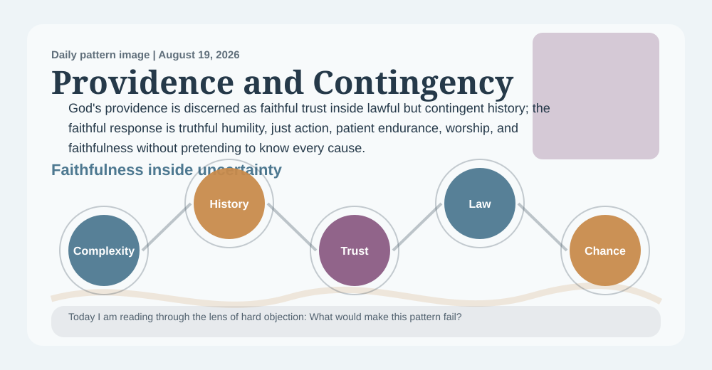
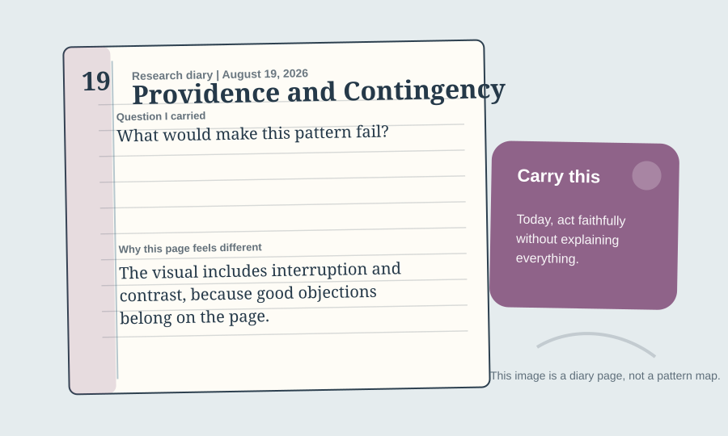

# A Priest Prayer Book Reading Of Providence And Contingency Pattern

_A daily book report for August 19, 2026, written as an Anglican priest formed by the 1928 Book of Common Prayer._

## Today's Office

I come to this report as a priest might come to the parish desk after Morning Prayer, with chapel, study, altar, and pulpit still in view: not looking first for novelty, but for truth that can be preached without vanity, confessed without evasion, prayed without presumption, and held within the Church's doctrine. The work still has research machinery beneath it, but today I want the reading to sound less like a parts list and more like a priest's notebook after prayer.

Yesterday's deaconess would have reminded me that a claim which cannot become mercy beside a bed, in a home, or among the lonely is not yet ready for the pulpit.

The daily pattern before me is **Providence And Contingency Pattern**. In plain speech, I would say it this way: Faithfulness means trusting God and acting well without pretending we know why every event happened. The movement underneath it is Stable Law -> Contingent Events -> Emergent Complexity -> Meaningful History.

The lens appointed for today is **hard objection**. I am not trying to say everything the project could say. I am carrying the question proper to this ministry: Can this claim be preached, confessed, prayed, and held within the Church's doctrine?

Today's focused question is: What would make this pattern fail?

## The Pattern In The Room

Someone loses a job, faces illness, or watches a plan collapse, and friends rush to explain what God must be doing. This pattern asks whether faith can pray, act, grieve, repent, and endure without pretending to know God's hidden reasons.

I am listening for whether this pattern can stand in the nave and the study as well as in private thought: named plainly, tested publicly, and restrained by worship.

In that room, the pattern is asking me to notice this: God's providence is discerned as faithful trust inside lawful but contingent history; the faithful response is truthful humility, just action, patient endurance, worship, and faithfulness without pretending to know every cause. I would not preach that as proof or carry it as a slogan. I would receive it as a possible sign of faithful order only if it can serve this ministry: doctrine, Scripture, creed, sacrament, worship, preaching, theological discernment, and public teaching.

## Today’s Discovery

The freshest thing in the available discovery record is not yet a claim for the pulpit, but a new cluster for the study: 14 candidate references, led by Crossref (8) and routed most strongly toward human_stories (6). This must be read cautiously, since the collector snapshot is current for this UTC day.

That cluster gives the priest work to test, not a sermon to announce. 10 new items is routed to the review queue. Optional `public_final_ready` metadata appears on 0 sources; 1 source currently carries reviewed-evidence-ready metadata.

No findings currently meet the optional polished-publication metadata state. Research findings remain visible below with their current strength and limitations; `public_final_ready` does not determine research visibility or theological authority.

## What Changed Since Yesterday

Yesterday's snapshot says the report stood under a deaconess reader, the **theologian pressure** lens, and **Augustine**. Today it stands under a priest reader, the **hard objection** lens, and **Aquinas**.

The named pattern changed from **Trinity-As-Behavior Pattern** to **Providence And Contingency Pattern**. candidate references fell from 25 to 14; review queue items held at 1,030; public-final claims held at 0. The strongest routed lane changed from **cultural_inputs** to **human_stories**.

The priestly reading should receive those changes at chapel, study, altar, and pulpit: useful for discernment, but not automatically ready for public teaching.

## The Theologian Beside The Prayer Book

The theologian section behind this entry draws on 357 analyzed theologian documents and gives special weight today to Trinity, Pneumatology, Christology.

Today's theologian is **Aquinas**, chosen from the rotating theologian voices gathered for this project. I would let Aquinas stand beside the Prayer Book and the priest voice today because of created order, virtue, and the final end of human life. Aquinas would ask whether the pattern participates in truth, goodness, and ordered love, while refusing to confuse a created sign with God himself.

The theological question is warm but exacting: can this claim pass through Christ, Scripture, the Creeds, worship, repentance, charity, and visible fruit?

The wider theologian panel matters too: Augustine would ask whether trust in providence is becoming love of God rather than control over explanation. Calvin would ask whether God's care is being confessed with reverence instead of speculation. Karl Barth would ask whether providence is being read through Jesus Christ rather than through bare events. Their presence keeps the report from becoming private inspiration. It must pass through Christ, Scripture, the Creeds, worship, repentance, charity, sacrament, and visible fruit.

Theologians should judge this pattern by whether it teaches trust, prayer, repentance, courage, and service while leaving room for grief, chance, mystery, and unfinished history.

## The 1928 Prayer Book Test

An Anglican priest shaped by the 1928 Book of Common Prayer would not begin by asking whether Providence And Contingency Pattern is clever. This priest would ask how it sounds within chapel, study, altar, pulpit, parish desk, and the gathered worship of the Church. The ministry in view is doctrine, Scripture, creed, sacrament, worship, preaching, theological discernment, and public teaching. It must pass through Christ, Scripture, the Creeds, worship, repentance, charity, sacrament, and visible fruit. The desire would be for the pattern to become reverence, repentance, charity, and steady duty. Under today's lens of hard objection, the counsel would be: test before Scripture, creed, altar, pulpit, and pastoral charity; let it make you more truthful at home, more merciful toward the weak, more faithful in worship, and less eager to explain what belongs to God. With Aquinas near a priest's parish desk after Morning Prayer, near chapel, altar, and pulpit, this priest would also listen for created order, virtue, and the final end of human life, asking whether the pattern has been purified by prayer, Scripture, and obedient love.

A priest must refuse any attractive pattern that cannot be preached honestly, prayed humbly, confessed within the Church's doctrine, or offered near the altar without overclaim.

The Prayer Book test must also say no. It says no to haste, no to decorative certainty, no to using holy language where repentance, repair, silence, or better evidence is required.

Today's objection is plain: A skeptic might say humans create providence stories to survive uncertainty, reduce anxiety, and impose meaning after the fact. The report should admit that psychology and history can explain many providence claims without proving divine action.

The specific failure condition is this: It weakens if it explains tragedy too neatly, blames victims, denies chance, or borrows science language beyond its scope.

The confidence therefore remains modest: Pastorally useful with limits: strong as a discipline of trust, weak as an explanation of hidden causes.

## Today's Rule Of Life

The rule for today is brief enough to obey: act faithfully without explaining everything.

Practice it in one restraint: do not teach or preach the claim beyond what Scripture, creed, worship, and charity can bear.

Let the report end in duty before it seeks admiration. A faithful pattern should leave a person readier for truth, mercy, justice, patience, and worship.

## Collect

O Lord, purify our doctrine, govern our preaching, deepen our worship, and make every true word fruitful in repentance and charity; through Jesus Christ our Lord. Amen.

## Research Behind This Reflection

The Providence And Contingency Pattern remains under evaluation. The current research supports it with qualifications: 8 traceable documents contribute to the inquiry, and the pattern is meaningful enough to keep testing.

Its central limitation is practical and severe: It weakens if it explains tragedy too neatly, blames victims, denies chance, or borrows science language beyond its scope. If the pattern does not change attention, protection, belonging, and service, its language has outrun its evidence and its obedience.

This evidence does not prove divine action, establish doctrine by research, or settle a theological judgment. Social movements, law, empathy, shared vulnerability, psychology, culture, and political history may explain much of the visible pattern. Research serves discernment; it does not replace Scripture, doctrine, worship, or the Church's judgment.

[Read the complete technical research record, including evidence, limitations, provenance, and Divine Core interpretation status](final_book_report_research_appendix.md).

## Recent Reading Behind This Pattern

These recent discoveries illuminate the question from several directions. They contribute evidence, qualifications, and objections, but none independently proves the theological pattern or constitutes Divine Core approval.

No recently discovered source is both sufficiently traceable and directly relevant to this pattern. The report does not add weak matches merely to fill the list.

## Quiet Notes For The Reader

This entry was generated at 2026-08-19 14:32 UTC. Tomorrow the pattern, the lens, the theologian, and the Anglican reader may change. The reader role alternates every other day between deaconess and priest so the report can keep both pastoral voices in view.

Input freshness: 2026-08-19 14:30 UTC. Collector snapshot is current for this UTC day.
