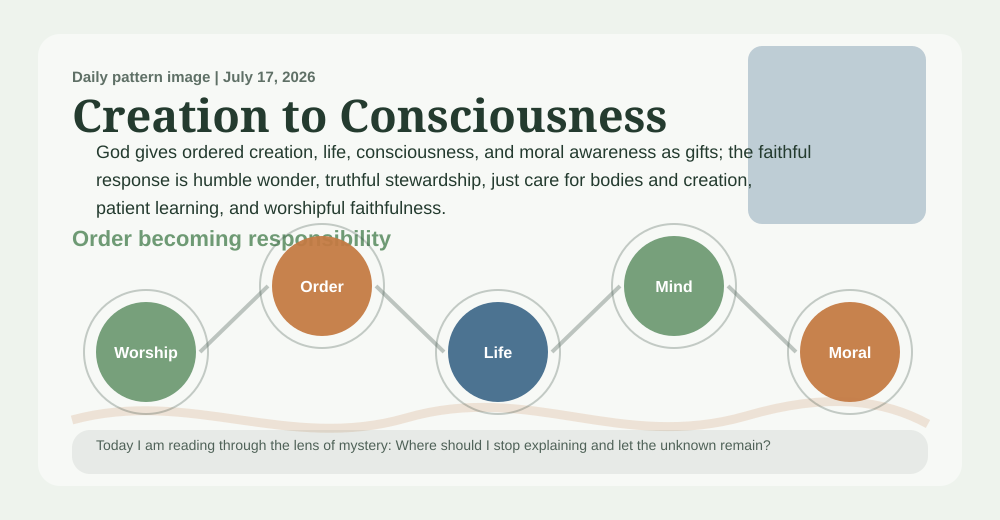
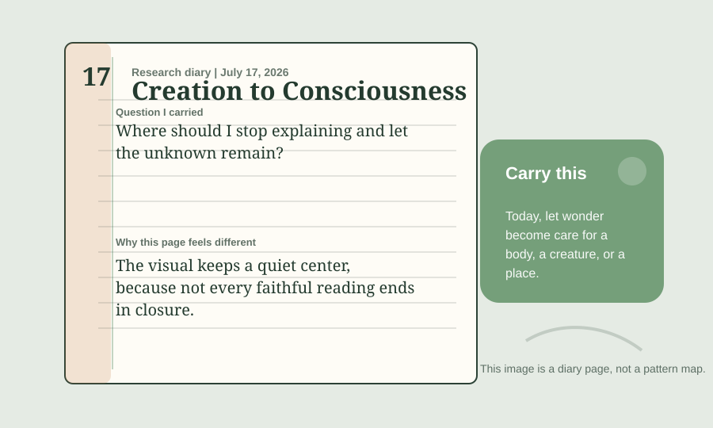

# A Deaconess Prayer Book Reading Of Creation-To-Consciousness Pattern

_A daily book report for July 17, 2026, written as an Anglican deaconess formed by the 1928 Book of Common Prayer and shaped by practical theology._

## Today's Office

I come to this report as a deaconess in the Anglican Church might return from Morning Prayer and the parish road: with Scripture still in the ear, the Prayer Book's order still shaping the heart, and particular souls still before me from homes, bedsides, schools, and works of mercy. This is practical theology under Anglican obedience, not a softer theology and not therapeutic technique: doctrine, worship, Scripture, prayer, ethics, and spiritual formation pressed toward faithful action. The work still has research machinery beneath it, but today I want the reading to sound less like a parts list and more like a deaconess's notebook after prayer, visitation, encouragement, and care for the poor and lonely.

The priestly caution of yesterday guards today's mercy from becoming sentiment: what I carry to homes and bedsides must still be true before Scripture, creed, and worship.

An Anglican deaconess formed by the 1928 Book of Common Prayer, shaped by practical theology, pastoral care, spiritual formation, Christian ethics, and the historic ministry of mercy within the Church.

The daily pattern before me is **Creation-To-Consciousness Pattern**. In plain speech, I would say it this way: Creation invites wonder, but wonder should turn into humility, care for bodies, and responsibility for the world. The movement underneath it is Physical Order -> Life -> Consciousness -> Moral Awareness -> Worship.

The lens appointed for today is **mystery**. I am not trying to say everything the project could say. I am carrying the question proper to this ministry: How does this truth become faithful action?

Today's focused question is: Where should I stop explaining and let the unknown remain?

## The Pattern In The Room

A student feels wonder while studying biology, consciousness, and the night sky, but also sees animal suffering, ecological damage, disability, and death. This pattern asks whether wonder can become humility and care without turning creation into a simplistic proof.

I am listening for what this pattern does in a room where someone is suffering, grieving, lonely, serving, learning, or in need of courage for ordinary obedience.

In that room, the pattern is asking me to notice this: God gives ordered creation, life, consciousness, and moral awareness as gifts; the faithful response is humble wonder, truthful stewardship, just care for bodies and creation, patient learning, and worshipful faithfulness. I would not preach that as proof or carry it as a slogan. I would receive it as a possible sign of faithful order only if it can serve this ministry: practical theology, pastoral theology, spiritual formation, Christian ethics, diaconal ministry, soul care, works of mercy, ordinary holiness, embodied obedience, service, and ordinary discipleship.

## Today’s Discovery

The freshest thing in the available discovery record is not a new certainty for the parish road, but a new cluster needing care: 18 candidate references, led by Crossref (12), with the strongest routed lane showing as deep_sources (7). This must be read cautiously, since the collector snapshot is current for this UTC day.

That is a mercy-shaped warning rather than a comfort to distribute. 18 new items may be ready for the review queue, no recorded category appears in the media mix, and optional `public_final_ready` metadata appears on 0 sources.

No findings currently meet the optional polished-publication metadata state. Research findings remain visible below with their current strength and limitations; `public_final_ready` does not determine research visibility or theological authority.

## What Changed Since Yesterday

Yesterday's snapshot says the report stood under a priest reader, the **faithful response** lens, and **Martin Luther**. Today it stands under a deaconess reader, the **mystery** lens, and **Karl Barth**.

The prior snapshot used a retired visibility placeholder; today's named pattern is **Creation-To-Consciousness Pattern**. candidate references fell from 31 to 18; review queue items held at 1,030; public-final claims held at 0. The strongest routed lane changed from **human_stories** to **deep_sources**.

The deaconess reading should carry those changes onto the parish road carefully: useful for attention, but not automatically ready for homes, bedsides, or wounded hearts.

## The Theologian Beside The Prayer Book

The theologian section behind this entry draws on 188 analyzed theologian documents and gives special weight today to Christology, Theodicy and Suffering, Trinity.

Today's theologian is **Karl Barth**, chosen from the rotating theologian voices gathered for this project. I would let Karl Barth stand beside the Prayer Book and the deaconess voice today because of God's self-revelation in Jesus Christ. Barth would ask whether the pattern begins with God's revelation in Christ or whether it tries to climb up to God from human observation.

The theological question is therefore not smaller, but nearer to the ground: can this claim be prayed, read with Scripture, formed by worship, tested by Church teaching, obeyed in mercy, and carried without harming vulnerable souls?

The wider theologian panel matters too: Athanasius would ask whether creation is being understood through the Word who gives and sustains life. Aquinas would ask whether natural order points to God without pretending every scientific question has become theology. John Polkinghorne would ask whether science is being respected on its own terms before theological reflection begins. Their presence keeps the report from becoming private inspiration. It must pass through Scripture, prayer, worship, Church teaching, the 1928 Prayer Book, mercy, embodied obedience, daily duty, and care for the vulnerable.

Theologians should judge this pattern by whether it honors creation as gift without turning science, intelligence, or consciousness into a ladder of superiority.

## The 1928 Prayer Book Test

An Anglican deaconess shaped by the 1928 Book of Common Prayer would not begin by asking whether Creation-To-Consciousness Pattern is clever. This deaconess would ask how it sounds within homes, bedsides, parish roads, schools, and the rooms of the poor and lonely. An Anglican deaconess formed by the 1928 Book of Common Prayer, shaped by practical theology, pastoral care, spiritual formation, Christian ethics, and the historic ministry of mercy within the Church. The ministry in view is practical theology, pastoral theology, spiritual formation, Christian ethics, diaconal ministry, soul care, works of mercy, ordinary holiness, embodied obedience, service, and ordinary discipleship. It must pass through Scripture, prayer, worship, Church teaching, the 1928 Prayer Book, mercy, embodied obedience, daily duty, and care for the vulnerable. The desire would be for the pattern to become reverence, repentance, charity, and steady duty. Under today's lens of mystery, the counsel would be: carry into visitation, teaching, encouragement, and works of mercy; let it make you more truthful at home, more merciful toward the weak, more faithful in worship, and less eager to explain what belongs to God. With Karl Barth near a deaconess's parish table after Morning Prayer and visitation, this deaconess would also listen for God's self-revelation in Jesus Christ, asking whether the pattern has been purified by prayer, Scripture, and obedient love.

A deaconess must refuse any beautiful pattern that makes suffering decorative, service sentimental, speech therapeutic instead of truthful, or vulnerable people carry the burden of someone else's certainty.

The Prayer Book test must also say no. It says no to haste, no to decorative certainty, no to using holy language where repentance, repair, silence, or better evidence is required.

Today's objection is plain: Science, evolution, cognition, and culture can explain much of the movement from order to life to mind without requiring a theological conclusion. The report should not smuggle God in where the evidence only supports wonder and humility.

The specific failure condition is this: It weakens if it ignores evolution, animal suffering, ecological loss, disability, or natural explanations.

The confidence therefore remains modest: Promising but needs pressure: useful for wonder and stewardship, not mature as a proof claim.

## Today's Rule Of Life

The rule for today is brief enough to obey: let wonder become care for a body, a creature, or a place.

Practice it in one restraint: do not carry an unready certainty into a conversation where a soul needs truth spoken gently, prayerfully, and with concrete mercy.

Let the report end in duty before it seeks admiration. A faithful pattern should leave a person readier for truth, mercy, justice, patience, and worship.

## Collect

O Lord, order our mercy, cleanse our speech, strengthen our hands for service, and make every true sign fruitful in care for the least and lonely; through Jesus Christ our Lord. Amen.

## Complete Research State

Every coherent, traceable candidate is shown here regardless of `public_final_ready`. Research strength controls the label and wording; public visibility does not imply theological approval.

### Supported with Qualifications: Image Of God Pattern

- **Plain-language description:** Every person matters before they produce, perform, succeed, or impress anyone.
- **Research question:** Does this pattern make ordinary people more likely to honor human dignity in daily life?
- **Research-strength status:** Supported with Qualifications
- **Status rationale:** 11 traceable indexed document(s) currently contribute to this candidate. The strongest existing research tier is `reviewed_evidence_ready`.
- **Supporting evidence:**
  - Application of the PCR method to detect the falsification of sheep milk with goat milk (developing_evidence)
  - Divine Pattern Candidates (candidate_lead)
  - Friction Layer (candidate_lead)
  - Next Research Expansion Tracker (developing_evidence)
  - Reviewed Source Packs (developing_evidence)
- **Counterevidence:**
  - None recorded; absence is not proof that none exists.
- **Rival explanations:**
  - Incomplete or unavailable.
- **Known limitations:**
  - counter_reading
  - doctrinal_fit
  - does_not_prove_boundary
  - ecclesial_review
  - evidence
  - final_promotion_restraint
- **Failure conditions:**
  - It weakens if dignity becomes a slogan while real vulnerable people remain ignored or ranked by usefulness.
- **Unresolved tensions:**
  - counter_reading
  - doctrinal_fit
  - does_not_prove_boundary
- **Provenance:**
  - research_documents/auto_imported_cloud_candidates/application_of_the_pcr_method_to_detect_the_falsification_of_sheep_milk_with_goa_c8de0c94f99a.md
  - research_documents/christian_sources/divine_pattern_candidates.md
  - research_documents/friction_layer.md
  - research_documents/next_research_expansion_tracker.md
  - research_documents/reviewed_source_packs.md
  - research_documents/source_packs/image_of_god_pattern_pack.md
  - history_inputs/reviewed_growth_batch_2026_05_27.md
  - pattern_tests/leading_patterns_pressure_2026_06_04.md
  - pattern_tests/leading_patterns_pressure_2026_06_04_second_pass.md
  - pattern_tests/leading_patterns_pressure_2026_06_04_third_pass.md
  - pattern_tests/top_five_pattern_competition_matrix.md
- **Provenance status:** `traceable_index_paths`
- **Divine Core theological interpretation:** `interpretation_not_evaluated`
- **What this finding does not prove:**
  - A non-proof boundary has not yet been recorded.
- **Presentation metadata:**
  - `public_final_ready`: `false` (additional polished-publication checks incomplete)
  - This metadata does not determine visibility, research strength, truth, or theological approval.

### Supported with Qualifications: Cross And Reversal Pattern

- **Plain-language description:** God's way of saving does not flatter power; it tells the truth, protects the harmed, and lets hope come through mercy and resurrection.
- **Research question:** Does this pattern help people tell the truth about harm while moving toward mercy, justice, and hope?
- **Research-strength status:** Supported with Qualifications
- **Status rationale:** 8 traceable indexed document(s) currently contribute to this candidate. The strongest existing research tier is `developing_evidence`.
- **Supporting evidence:**
  - Divine Pattern Candidates (candidate_lead)
  - Next Research Expansion Tracker (developing_evidence)
  - Reviewed Source Packs (developing_evidence)
  - Source Pack: Cross And Reversal Pattern (developing_evidence)
  - Leading Patterns Pressure Test, 2026-06-04 (candidate_lead)
- **Counterevidence:**
  - None recorded; absence is not proof that none exists.
- **Rival explanations:**
  - Incomplete or unavailable.
- **Known limitations:**
  - counter_reading
  - ecclesial_review
  - evidence
  - liturgical_grounding
  - machine_label_boundary
  - pastoral_safety
- **Failure conditions:**
  - It weakens if cross-language protects abusers, silences lament, or treats suffering itself as holy.
- **Unresolved tensions:**
  - counter_reading
  - ecclesial_review
  - evidence
- **Provenance:**
  - research_documents/christian_sources/divine_pattern_candidates.md
  - research_documents/next_research_expansion_tracker.md
  - research_documents/reviewed_source_packs.md
  - research_documents/source_packs/cross_and_reversal_pattern_pack.md
  - pattern_tests/leading_patterns_pressure_2026_06_04.md
  - pattern_tests/leading_patterns_pressure_2026_06_04_second_pass.md
  - pattern_tests/leading_patterns_pressure_2026_06_04_third_pass.md
  - pattern_tests/top_five_pattern_competition_matrix.md
- **Provenance status:** `traceable_index_paths`
- **Divine Core theological interpretation:** `interpretation_not_evaluated`
- **What this finding does not prove:**
  - A non-proof boundary has not yet been recorded.
- **Presentation metadata:**
  - `public_final_ready`: `false` (additional polished-publication checks incomplete)
  - This metadata does not determine visibility, research strength, truth, or theological approval.

### Supported with Qualifications: Creation-To-Consciousness Pattern

- **Plain-language description:** Creation invites wonder, but wonder should turn into humility, care for bodies, and responsibility for the world.
- **Research question:** Does this pattern create wonder and responsibility without pretending science mechanically proves worship?
- **Research-strength status:** Supported with Qualifications
- **Status rationale:** 8 traceable indexed document(s) currently contribute to this candidate. The strongest existing research tier is `developing_evidence`.
- **Supporting evidence:**
  - Divine Pattern Candidates (candidate_lead)
  - Next Research Expansion Tracker (developing_evidence)
  - Reviewed Source Packs (developing_evidence)
  - Source Pack: Creation-To-Consciousness Pattern (developing_evidence)
  - Leading Patterns Pressure Test, 2026-06-04 (candidate_lead)
- **Counterevidence:**
  - None recorded; absence is not proof that none exists.
- **Rival explanations:**
  - Incomplete or unavailable.
- **Known limitations:**
  - counter_reading
  - ecclesial_review
  - evidence
  - liturgical_grounding
  - machine_label_boundary
  - pastoral_safety
- **Failure conditions:**
  - It weakens if it ignores evolution, animal suffering, ecological loss, disability, or natural explanations.
- **Unresolved tensions:**
  - counter_reading
  - ecclesial_review
  - evidence
- **Provenance:**
  - research_documents/christian_sources/divine_pattern_candidates.md
  - research_documents/next_research_expansion_tracker.md
  - research_documents/reviewed_source_packs.md
  - research_documents/source_packs/creation_to_consciousness_pattern_pack.md
  - pattern_tests/leading_patterns_pressure_2026_06_04.md
  - pattern_tests/leading_patterns_pressure_2026_06_04_second_pass.md
  - pattern_tests/leading_patterns_pressure_2026_06_04_third_pass.md
  - pattern_tests/top_five_pattern_competition_matrix.md
- **Provenance status:** `traceable_index_paths`
- **Divine Core theological interpretation:** `interpretation_not_evaluated`
- **What this finding does not prove:**
  - A non-proof boundary has not yet been recorded.
- **Presentation metadata:**
  - `public_final_ready`: `false` (additional polished-publication checks incomplete)
  - This metadata does not determine visibility, research strength, truth, or theological approval.

### Supported with Qualifications: Trinity-As-Behavior Pattern

- **Plain-language description:** True doctrine should become visible as love, humility, holiness, unity, service, and patient faithfulness.
- **Research question:** Does this pattern keep the Trinity Christian, concrete, and fruitful rather than vague or controlling?
- **Research-strength status:** Supported with Qualifications
- **Status rationale:** 9 traceable indexed document(s) currently contribute to this candidate. The strongest existing research tier is `developing_evidence`.
- **Supporting evidence:**
  - Divine Pattern Candidates (candidate_lead)
  - Daily Cloud Reference Review Log (candidate_lead)
  - Next Research Expansion Tracker (developing_evidence)
  - Reviewed Source Packs (developing_evidence)
  - Source Pack: Trinity-As-Behavior Pattern (developing_evidence)
- **Counterevidence:**
  - None recorded; absence is not proof that none exists.
- **Rival explanations:**
  - Incomplete or unavailable.
- **Known limitations:**
  - counter_reading
  - ecclesial_review
  - evidence
  - liturgical_grounding
  - machine_label_boundary
  - pastoral_safety
- **Failure conditions:**
  - It weakens if the Trinity becomes a metaphor for group energy, authoritarian control, modalism, or three separate gods.
- **Unresolved tensions:**
  - counter_reading
  - ecclesial_review
  - evidence
- **Provenance:**
  - research_documents/christian_sources/divine_pattern_candidates.md
  - research_documents/daily_cloud_reference_review_log.md
  - research_documents/next_research_expansion_tracker.md
  - research_documents/reviewed_source_packs.md
  - research_documents/source_packs/trinity_as_behavior_pattern_pack.md
  - pattern_tests/leading_patterns_pressure_2026_06_04.md
  - pattern_tests/leading_patterns_pressure_2026_06_04_second_pass.md
  - pattern_tests/leading_patterns_pressure_2026_06_04_third_pass.md
  - pattern_tests/top_five_pattern_competition_matrix.md
- **Provenance status:** `traceable_index_paths`
- **Divine Core theological interpretation:** `interpretation_not_evaluated`
- **What this finding does not prove:**
  - A non-proof boundary has not yet been recorded.
- **Presentation metadata:**
  - `public_final_ready`: `false` (additional polished-publication checks incomplete)
  - This metadata does not determine visibility, research strength, truth, or theological approval.

### Supported with Qualifications: Providence And Contingency Pattern

- **Plain-language description:** Faithfulness means trusting God and acting well without pretending we know why every event happened.
- **Research question:** Does this pattern help ordinary people act faithfully inside uncertainty?
- **Research-strength status:** Supported with Qualifications
- **Status rationale:** 8 traceable indexed document(s) currently contribute to this candidate. The strongest existing research tier is `developing_evidence`.
- **Supporting evidence:**
  - Divine Pattern Candidates (candidate_lead)
  - Next Research Expansion Tracker (developing_evidence)
  - Reviewed Source Packs (developing_evidence)
  - Source Pack: Providence And Contingency Pattern (developing_evidence)
  - Leading Patterns Pressure Test, 2026-06-04 (candidate_lead)
- **Counterevidence:**
  - None recorded; absence is not proof that none exists.
- **Rival explanations:**
  - Incomplete or unavailable.
- **Known limitations:**
  - counter_reading
  - ecclesial_review
  - evidence
  - liturgical_grounding
  - machine_label_boundary
  - pastoral_safety
- **Failure conditions:**
  - It weakens if it explains tragedy too neatly, blames victims, denies chance, or borrows science language beyond its scope.
- **Unresolved tensions:**
  - counter_reading
  - ecclesial_review
  - evidence
- **Provenance:**
  - research_documents/christian_sources/divine_pattern_candidates.md
  - research_documents/next_research_expansion_tracker.md
  - research_documents/reviewed_source_packs.md
  - research_documents/source_packs/providence_and_contingency_pattern_pack.md
  - pattern_tests/leading_patterns_pressure_2026_06_04.md
  - pattern_tests/leading_patterns_pressure_2026_06_04_second_pass.md
  - pattern_tests/leading_patterns_pressure_2026_06_04_third_pass.md
  - pattern_tests/top_five_pattern_competition_matrix.md
- **Provenance status:** `traceable_index_paths`
- **Divine Core theological interpretation:** `interpretation_not_evaluated`
- **What this finding does not prove:**
  - A non-proof boundary has not yet been recorded.
- **Presentation metadata:**
  - `public_final_ready`: `false` (additional polished-publication checks incomplete)
  - This metadata does not determine visibility, research strength, truth, or theological approval.

## Quiet Notes For The Reader

This entry was generated at 2026-07-17 16:24 UTC. Tomorrow the pattern, the lens, the theologian, and the Anglican reader may change. The reader role alternates every other day between deaconess and priest so the report can keep both pastoral voices in view.

Input freshness: 2026-07-17 16:23 UTC. Collector snapshot is current for this UTC day.
