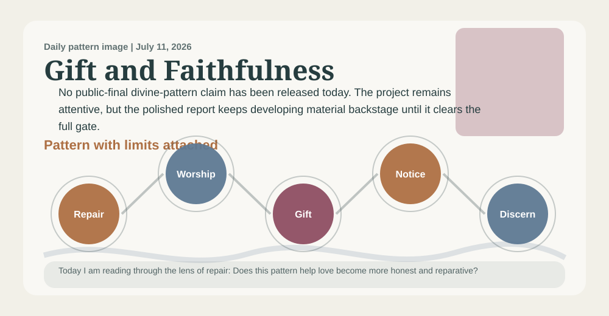
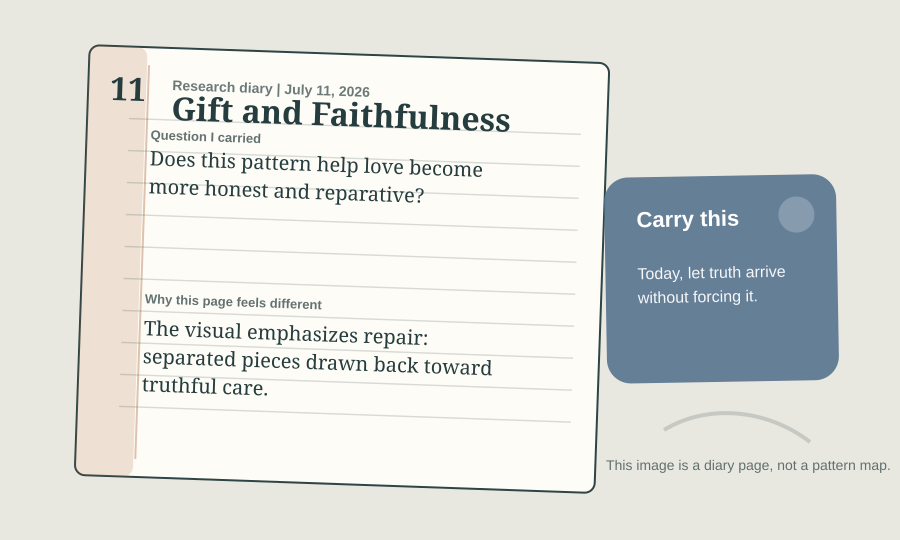

# A Deaconess Prayer Book Reading Of Waiting For A Public-Final Claim

_A daily book report for July 11, 2026, written as an Anglican deaconess formed by the 1928 Book of Common Prayer and shaped by practical theology._

## Today's Office

I come to this report as a deaconess in the Anglican Church might return from Morning Prayer and the parish road: with Scripture still in the ear, the Prayer Book's order still shaping the heart, and particular souls still before me from homes, bedsides, schools, and works of mercy. This is practical theology under Anglican obedience, not a softer theology and not therapeutic technique: doctrine, worship, Scripture, prayer, ethics, and spiritual formation pressed toward faithful action. The work still has research machinery beneath it, but today I want the reading to sound less like a parts list and more like a deaconess's notebook after prayer, visitation, encouragement, and care for the poor and lonely.

The priestly caution of yesterday guards today's mercy from becoming sentiment: what I carry to homes and bedsides must still be true before Scripture, creed, and worship.

An Anglican deaconess formed by the 1928 Book of Common Prayer, shaped by practical theology, pastoral care, spiritual formation, Christian ethics, and the historic ministry of mercy within the Church.

The daily pattern before me is **Waiting For A Public-Final Claim**. In plain speech, I would say it this way: No pattern has cleared the full public-final gate yet, so the final report waits rather than turning developing material into a public claim. The movement underneath it is Waiting -> Discernment -> Truthful Silence -> Faithful Readiness.

The lens appointed for today is **repair**. I am not trying to say everything the project could say. I am carrying the question proper to this ministry: How does this truth become faithful action?

Today's focused question is: Does this pattern help love become more honest and reparative?

## The Pattern In The Room

A reader opens the final report hoping for a settled public claim, but the system has not found one that passed every public-final boundary. The faithful shape of the day is therefore patience rather than performance.

I am listening for what this pattern does in a room where someone is suffering, grieving, lonely, serving, learning, or in need of courage for ordinary obedience.

In that room, the pattern is asking me to notice this: No public-final divine-pattern claim has been released today. The project remains attentive, but the polished report keeps developing material backstage until it clears the full gate. I would not preach that as proof or carry it as a slogan. I would receive it as a possible sign of faithful order only if it can serve this ministry: practical theology, pastoral theology, spiritual formation, Christian ethics, diaconal ministry, soul care, works of mercy, ordinary holiness, embodied obedience, service, and ordinary discipleship.

## Today’s Discovery

The freshest thing in the available discovery record is not a new certainty for the parish road, but a new cluster needing care: 46 candidate references, led by Crossref (25), with the strongest routed lane showing as all_texts (20). This must be read cautiously, since the collector snapshot is current for this UTC day.

That is a mercy-shaped warning rather than a comfort to distribute. 31 new items may be ready for the review queue, video (7) appears in the media mix, and the public-final gate has released 0 claims.

For the parish road, that absence is itself a finding. A deaconess may encourage patience, truthful speech, and service, while refusing to carry an unready claim into wounded hearts as certainty.

## What Changed Since Yesterday

Yesterday's snapshot says the report stood under a priest reader, the **mystery** lens, and **James Cone**. Today it stands under a deaconess reader, the **repair** lens, and **Sarah Coakley**.

The named pattern did not change: it remains **Waiting For A Public-Final Claim**. candidate references rose from 32 to 46; review queue items held at 1,030; public-final claims held at 0. The strongest routed lane changed from **theologians** to **all_texts**.

The deaconess reading should carry those changes onto the parish road carefully: useful for attention, but not automatically ready for homes, bedsides, or wounded hearts.

## The Theologian Beside The Prayer Book

The theologian section behind this entry draws on 166 analyzed theologian documents and gives special weight today to Christology, Theodicy and Suffering, Trinity.

Today's theologian is **Sarah Coakley**, chosen from the rotating theologian voices gathered for this project. I would let Sarah Coakley stand beside the Prayer Book and the deaconess voice today because of prayer, desire, and contemplative discipline. Coakley would ask whether the pattern is being purified by prayer, or whether desire is quietly shaping the conclusion before discernment has done its work.

The theological question is therefore not smaller, but nearer to the ground: can this claim be prayed, read with Scripture, formed by worship, tested by Church teaching, obeyed in mercy, and carried without harming vulnerable souls?

The wider theologian panel matters too: Augustine would ask whether restraint is helping love stay rightly ordered. Karl Barth would ask whether the project is refusing to speak where God has not given warrant. Bonhoeffer would ask whether silence is responsible obedience rather than evasion. Their presence keeps the report from becoming private inspiration. It must pass through Scripture, prayer, worship, Church teaching, the 1928 Prayer Book, mercy, embodied obedience, daily duty, and care for the vulnerable.

Theologians should receive this pause as part of the project's discipline: a claim that has not passed Scripture, doctrine, pastoral safety, and public-use boundaries should remain quiet.

## The 1928 Prayer Book Test

An Anglican deaconess shaped by the 1928 Book of Common Prayer would not begin by asking whether Waiting For A Public-Final Claim is clever. This deaconess would ask how it sounds within homes, bedsides, parish roads, schools, and the rooms of the poor and lonely. An Anglican deaconess formed by the 1928 Book of Common Prayer, shaped by practical theology, pastoral care, spiritual formation, Christian ethics, and the historic ministry of mercy within the Church. The ministry in view is practical theology, pastoral theology, spiritual formation, Christian ethics, diaconal ministry, soul care, works of mercy, ordinary holiness, embodied obedience, service, and ordinary discipleship. It must pass through Scripture, prayer, worship, Church teaching, the 1928 Prayer Book, mercy, embodied obedience, daily duty, and care for the vulnerable. The desire would be for the pattern to become reverence, repentance, charity, and steady duty. Under today's lens of repair, the counsel would be: carry into visitation, teaching, encouragement, and works of mercy; let it make you more truthful at home, more merciful toward the weak, more faithful in worship, and less eager to explain what belongs to God. With Sarah Coakley near a deaconess's parish table after Morning Prayer and visitation, this deaconess would also listen for prayer, desire, and contemplative discipline, asking whether the pattern has been purified by prayer, Scripture, and obedient love.

A deaconess must refuse any beautiful pattern that makes suffering decorative, service sentimental, speech therapeutic instead of truthful, or vulnerable people carry the burden of someone else's certainty.

The Prayer Book test must also say no. It says no to haste, no to decorative certainty, no to using holy language where repentance, repair, silence, or better evidence is required.

Today's objection is plain: A reader may want the report to say more. The answer is that the final report should not borrow confidence from material still under review.

The specific failure condition is this: It weakens if waiting becomes neglect, or if quietness is used to avoid truth that has actually passed the tests.

The confidence therefore remains modest: No public-final claim has been released today; the report is waiting for a claim that has passed every public-use boundary.

## Today's Rule Of Life

The rule for today is brief enough to obey: let truth arrive without forcing it.

Practice it in one restraint: do not carry an unready certainty into a conversation where a soul needs truth spoken gently, prayerfully, and with concrete mercy.

Let the report end in duty before it seeks admiration. A faithful pattern should leave a person readier for truth, mercy, justice, patience, and worship.

## Collect

O Lord, order our mercy, cleanse our speech, strengthen our hands for service, and make every true sign fruitful in care for the least and lonely; through Jesus Christ our Lord. Amen.

## Quiet Notes For The Reader

This entry was generated at 2026-07-11 14:51 UTC. Tomorrow the pattern, the lens, the theologian, and the Anglican reader may change. The reader role alternates every other day between deaconess and priest so the report can keep both pastoral voices in view.

Input freshness: 2026-07-11 14:50 UTC. Collector snapshot is current for this UTC day.
