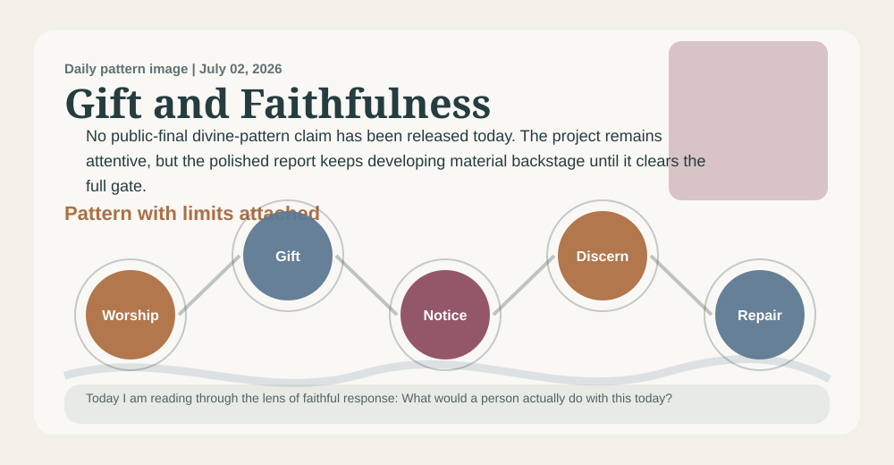
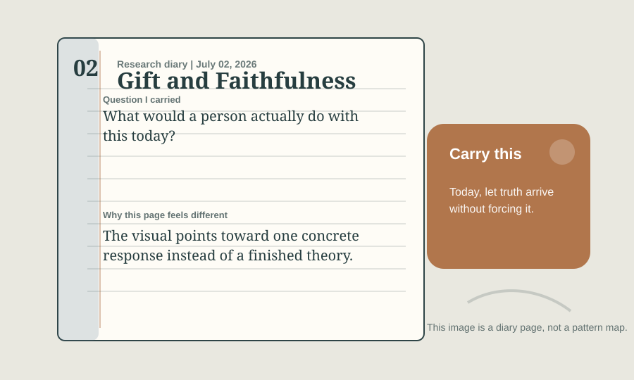

# A Priest Prayer Book Reading Of Waiting For A Public-Final Claim

_A daily book report for July 02, 2026, written as an Anglican priest formed by the 1928 Book of Common Prayer._

## Today's Office

I come to this report as a priest might come to the parish desk after Morning Prayer, with chapel, study, altar, and pulpit still in view: not looking first for novelty, but for truth that can be preached without vanity, confessed without evasion, prayed without presumption, and held within the Church's doctrine. The work still has research machinery beneath it, but today I want the reading to sound less like a parts list and more like a priest's notebook after prayer.

Yesterday's deaconess would have reminded me that a claim which cannot become mercy beside a bed, in a home, or among the lonely is not yet ready for the pulpit.

The daily pattern before me is **Waiting For A Public-Final Claim**. In plain speech, I would say it this way: No pattern has cleared the full public-final gate yet, so the final report waits rather than turning developing material into a public claim. The movement underneath it is Waiting -> Discernment -> Truthful Silence -> Faithful Readiness.

The lens appointed for today is **faithful response**. I am not trying to say everything the project could say. I am carrying the question proper to this ministry: Can this claim be preached, confessed, prayed, and held within the Church's doctrine?

Today's focused question is: What would a person actually do with this today?

## The Pattern In The Room

A reader opens the final report hoping for a settled public claim, but the system has not found one that passed every public-final boundary. The faithful shape of the day is therefore patience rather than performance.

I am listening for whether this pattern can stand in the nave and the study as well as in private thought: named plainly, tested publicly, and restrained by worship.

In that room, the pattern is asking me to notice this: No public-final divine-pattern claim has been released today. The project remains attentive, but the polished report keeps developing material backstage until it clears the full gate. I would not preach that as proof or carry it as a slogan. I would receive it as a possible sign of faithful order only if it can serve this ministry: doctrine, Scripture, creed, sacrament, worship, preaching, theological discernment, and public teaching.

## Today’s Discovery

The freshest thing in the available discovery record is not yet a claim for the pulpit, but a new cluster for the study: 24 candidate references, led by Crossref (14) and routed most strongly toward visual_art (12). This must be read cautiously, since the collector snapshot is current for this UTC day.

That cluster gives the priest work to test, not a sermon to announce. 11 new items may be ready for the review queue, while the public-final gate has released 0 claims, with 1 reviewed-evidence-ready source still requiring public-use judgment.

That absence is meaningful: the report found something to withhold. A priestly reading should treat that restraint as doctrine serving charity, not as a failure of imagination.

## What Changed Since Yesterday

Yesterday's snapshot says the report stood under a deaconess reader, the **hard objection** lens, and **James Cone**. Today it stands under a priest reader, the **faithful response** lens, and **Sarah Coakley**.

The named pattern did not change: it remains **Waiting For A Public-Final Claim**. candidate references fell from 35 to 24; review queue items held at 1,030; public-final claims held at 0. The strongest routed lane changed from **human_stories** to **visual_art**.

The priestly reading should receive those changes at chapel, study, altar, and pulpit: useful for discernment, but not automatically ready for public teaching.

## The Theologian Beside The Prayer Book

The theologian section behind this entry draws on 120 analyzed theologian documents and gives special weight today to Christology, Theodicy and Suffering, Creation.

Today's theologian is **Sarah Coakley**, chosen from the rotating theologian voices gathered for this project. I would let Sarah Coakley stand beside the Prayer Book and the priest voice today because of prayer, desire, and contemplative discipline. Coakley would ask whether the pattern is being purified by prayer, or whether desire is quietly shaping the conclusion before discernment has done its work.

The theological question is warm but exacting: can this claim pass through Christ, Scripture, the Creeds, worship, repentance, charity, and visible fruit?

The wider theologian panel matters too: Augustine would ask whether restraint is helping love stay rightly ordered. Karl Barth would ask whether the project is refusing to speak where God has not given warrant. Bonhoeffer would ask whether silence is responsible obedience rather than evasion. Their presence keeps the report from becoming private inspiration. It must pass through Christ, Scripture, the Creeds, worship, repentance, charity, sacrament, and visible fruit.

Theologians should receive this pause as part of the project's discipline: a claim that has not passed Scripture, doctrine, pastoral safety, and public-use boundaries should remain quiet.

## The 1928 Prayer Book Test

An Anglican priest shaped by the 1928 Book of Common Prayer would not begin by asking whether Waiting For A Public-Final Claim is clever. This priest would ask how it sounds within chapel, study, altar, pulpit, parish desk, and the gathered worship of the Church. The ministry in view is doctrine, Scripture, creed, sacrament, worship, preaching, theological discernment, and public teaching. It must pass through Christ, Scripture, the Creeds, worship, repentance, charity, sacrament, and visible fruit. The desire would be for the pattern to become reverence, repentance, charity, and steady duty. Under today's lens of faithful response, the counsel would be: test before Scripture, creed, altar, pulpit, and pastoral charity; let it make you more truthful at home, more merciful toward the weak, more faithful in worship, and less eager to explain what belongs to God. With Sarah Coakley near a priest's parish desk after Morning Prayer, near chapel, altar, and pulpit, this priest would also listen for prayer, desire, and contemplative discipline, asking whether the pattern has been purified by prayer, Scripture, and obedient love.

A priest must refuse any attractive pattern that cannot be preached honestly, prayed humbly, confessed within the Church's doctrine, or offered near the altar without overclaim.

The Prayer Book test must also say no. It says no to haste, no to decorative certainty, no to using holy language where repentance, repair, silence, or better evidence is required.

Today's objection is plain: A reader may want the report to say more. The answer is that the final report should not borrow confidence from material still under review.

The specific failure condition is this: It weakens if waiting becomes neglect, or if quietness is used to avoid truth that has actually passed the tests.

The confidence therefore remains modest: No public-final claim has been released today; the report is waiting for a claim that has passed every public-use boundary.

## Today's Rule Of Life

The rule for today is brief enough to obey: let truth arrive without forcing it.

Practice it in one restraint: do not teach or preach the claim beyond what Scripture, creed, worship, and charity can bear.

Let the report end in duty before it seeks admiration. A faithful pattern should leave a person readier for truth, mercy, justice, patience, and worship.

## Collect

O Lord, purify our doctrine, govern our preaching, deepen our worship, and make every true word fruitful in repentance and charity; through Jesus Christ our Lord. Amen.

## Quiet Notes For The Reader

This entry was generated at 2026-07-02 16:14 UTC. Tomorrow the pattern, the lens, the theologian, and the Anglican reader may change. The reader role alternates every other day between deaconess and priest so the report can keep both pastoral voices in view.

Input freshness: 2026-07-02 16:12 UTC. Collector snapshot is current for this UTC day.
